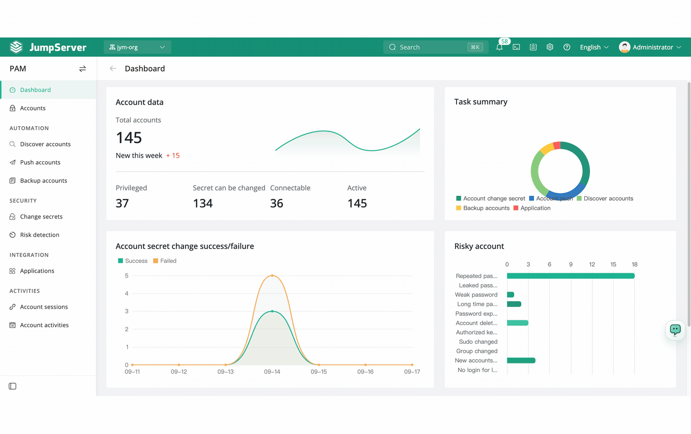

<div align="center">
  <a name="readme-top"></a>
  <a href="https://jumpserver.com" target="_blank"></a>
  
## An open-source PAM platform (Bastion Host)

[![][license-shield]][license-link]
[![][docs-shield]][docs-link]
[![][deepwiki-shield]][deepwiki-link]
[![][discord-shield]][discord-link]
[![][docker-shield]][docker-link]
[![][github-release-shield]][github-release-link]
[![][github-stars-shield]][github-stars-link]

[English](/README.md) · [中文(简体)](/readmes/README.zh-hans.md) · [中文(繁體)](/readmes/README.zh-hant.md) · [日本語](/readmes/README.ja.md) · [Português (Brasil)](/readmes/README.pt-br.md) · [Español](/readmes/README.es.md) · [Русский](/readmes/README.ru.md) · [한국어](/readmes/README.ko.md) · [Tiếng Việt](/readmes/README.vi.md)

</div>

<br/>

## What is JumpServer?

JumpServer is an open-source Privileged Access Management (PAM) platform with AI-powered capabilities. It gives DevOps and IT teams a unified workspace for secure access to SSH, RDP, Kubernetes, databases, websites, RemoteApp, VirtualApp, and more.


## Quickstart

Prepare a clean 64-bit Linux server with at least 4 CPU cores and 8 GB of RAM.

```sh
curl -sSL https://github.com/jumpserver/jumpserver/releases/latest/download/quick_start.sh | bash
```

Open JumpServer in your browser at `http://your-jumpserver-ip/`

- Username: `admin`
- Password: `ChangeMe`

## Screenshots

<p align="center"></p>

## Components

JumpServer groups its components by role. Core projects provide the platform, web interface, terminal, protocol connections, and AI capabilities. Enterprise components extend application and protocol access. Supporting services handle session recordings and host operations, while deployment tools simplify installation and web delivery.

### Core Projects

<table width="100%">
  <thead>
    <tr>
      <th width="20%" align="left">Project</th>
      <th width="16%" align="center"><div align="center">Version</div></th>
      <th width="64%" align="center"><div align="center">Description</div></th>
    </tr>
  </thead>
  <tbody>
    <tr>
      <td width="20%" align="left" nowrap><a href="https://github.com/jumpserver/jumpserver">JumpServer</a></td>
      <td width="16%" align="center"><div align="center"><a href="https://github.com/jumpserver/jumpserver/tags"></a></div></td>
      <td width="64%" align="left">Open-source Privileged Access Management platform</td>
    </tr>
    <tr>
      <td width="20%" align="left" nowrap><a href="https://github.com/jumpserver/lina">Lina</a></td>
      <td width="16%" align="center"><div align="center"><a href="https://github.com/jumpserver/lina/tags"></a></div></td>
      <td width="64%" align="left">JumpServer web interface</td>
    </tr>
    <tr>
      <td width="20%" align="left" nowrap><a href="https://github.com/jumpserver/luna">Luna</a></td>
      <td width="16%" align="center"><div align="center"><a href="https://github.com/jumpserver/luna/tags"></a></div></td>
      <td width="64%" align="left">JumpServer web terminal and native client</td>
    </tr>
    <tr>
      <td width="20%" align="left" nowrap><a href="https://github.com/jumpserver/koko">KoKo</a></td>
      <td width="16%" align="center"><div align="center"><a href="https://github.com/jumpserver/koko/tags"></a></div></td>
      <td width="64%" align="left">JumpServer general-purpose protocol connector and proxy</td>
    </tr>
    <tr>
      <td width="20%" align="left" nowrap><a href="https://github.com/jumpserver/chen">Chen</a></td>
      <td width="16%" align="center"><div align="center"><a href="https://github.com/jumpserver/chen/tags"></a></div></td>
      <td width="64%" align="left">JumpServer web database connector</td>
    </tr>
    <tr>
      <td width="20%" align="left" nowrap><a href="https://github.com/jumpserver/kael">Kael</a></td>
      <td width="16%" align="center"><div align="center"><a href="https://github.com/jumpserver/kael/tags"></a></div></td>
      <td width="64%" align="left">JumpServer AI component</td>
    </tr>
  </tbody>
</table>

### Enterprise Components

<table width="100%">
  <thead>
    <tr>
      <th width="20%" align="left">Project</th>
      <th width="16%" align="center"><div align="center">Version</div></th>
      <th width="64%" align="center"><div align="center">Description</div></th>
    </tr>
  </thead>
  <tbody>
    <tr>
      <td width="20%" align="left" nowrap><a href="https://github.com/jumpserver/tinker">Tinker</a></td>
      <td width="16%" align="center"><div align="center"></div></td>
      <td width="64%" align="left">JumpServer Windows application connector (free for Community Edition)</td>
    </tr>
    <tr>
      <td width="20%" align="left" nowrap><a href="https://github.com/jumpserver/Panda">Panda</a></td>
      <td width="16%" align="center"><div align="center"></div></td>
      <td width="64%" align="left">JumpServer Enterprise Edition Linux application connector</td>
    </tr>
    <tr>
      <td width="20%" align="left" nowrap><a href="https://github.com/jumpserver/razor">Razor</a></td>
      <td width="16%" align="center"><div align="center"></div></td>
      <td width="64%" align="left">JumpServer Enterprise Edition RDP protocol proxy</td>
    </tr>
    <tr>
      <td width="20%" align="left" nowrap><a href="https://github.com/jumpserver/magnus">Magnus</a></td>
      <td width="16%" align="center"><div align="center"></div></td>
      <td width="64%" align="left">JumpServer Enterprise Edition database protocol proxy</td>
    </tr>
    <tr>
      <td width="20%" align="left" nowrap><a href="https://github.com/jumpserver/nec">Nec</a></td>
      <td width="16%" align="center"><div align="center"></div></td>
      <td width="64%" align="left">JumpServer Enterprise Edition VNC protocol proxy</td>
    </tr>
  </tbody>
</table>

### Supporting Services

<table width="100%">
  <thead>
    <tr>
      <th width="20%" align="left">Project</th>
      <th width="16%" align="center"><div align="center">Version</div></th>
      <th width="64%" align="center"><div align="center">Description</div></th>
    </tr>
  </thead>
  <tbody>
    <tr>
      <td width="20%" align="left" nowrap><a href="https://github.com/jumpserver/video-worker">Video&nbsp;Worker</a></td>
      <td width="16%" align="center"><div align="center"></div></td>
      <td width="64%" align="left">JumpServer Enterprise Edition session recording transcoding worker</td>
    </tr>
    <tr>
      <td width="20%" align="left" nowrap><a href="https://github.com/jumpserver/jdmc">JDMC</a></td>
      <td width="16%" align="center"><div align="center"></div></td>
      <td width="64%" align="left">JumpServer Enterprise Edition host operations and management service</td>
    </tr>
  </tbody>
</table>

### Deployment & Tooling

<table width="100%">
  <thead>
    <tr>
      <th width="20%" align="left">Project</th>
      <th width="16%" align="center"><div align="center">Version</div></th>
      <th width="64%" align="center"><div align="center">Description</div></th>
    </tr>
  </thead>
  <tbody>
    <tr>
      <td width="20%" align="left" nowrap><a href="https://github.com/jumpserver/installer">Installer</a></td>
      <td width="16%" align="center"><div align="center"><a href="https://github.com/jumpserver/installer/tags"></a></div></td>
      <td width="64%" align="left">JumpServer installation and management tool</td>
    </tr>
    <tr>
      <td width="20%" align="left" nowrap><a href="https://github.com/jumpserver/docker-web">Docker&nbsp;Web</a></td>
      <td width="16%" align="center"><div align="center"><a href="https://github.com/jumpserver/docker-web/tags"></a></div></td>
      <td width="64%" align="left">JumpServer web gateway and static assets</td>
    </tr>
  </tbody>
</table>

## Contributing

Contributions are welcome. See [CONTRIBUTING.md][contributing-link] for guidelines.

## License

Copyright (c) 2014-2026 FIT2CLOUD, All rights reserved.

Licensed under The GNU General Public License version 3 (GPLv3) (the "License"); you may not use this file except in compliance with the License. You may obtain a copy of the License at

https://www.gnu.org/licenses/gpl-3.0.html

Unless required by applicable law or agreed to in writing, software distributed under the License is distributed on an " AS IS" BASIS, WITHOUT WARRANTIES OR CONDITIONS OF ANY KIND, either express or implied. See the License for the specific language governing permissions and limitations under the License.

<!-- JumpServer official link -->
[docs-link]: https://jumpserver.com/docs
[discord-link]: https://discord.com/invite/W6vYXmAQG2
[deepwiki-link]: https://deepwiki.com/jumpserver/jumpserver/
[contributing-link]: https://github.com/jumpserver/jumpserver/blob/dev/CONTRIBUTING.md

<!-- JumpServer Other link-->
[license-link]: https://www.gnu.org/licenses/gpl-3.0.html
[docker-link]: https://hub.docker.com/u/jumpserver
[github-release-link]: https://github.com/jumpserver/jumpserver/releases/latest
[github-stars-link]: https://github.com/jumpserver/jumpserver
[github-issues-link]: https://github.com/jumpserver/jumpserver/issues

<!-- Shield link-->
[docs-shield]: https://img.shields.io/badge/documentation-148F76
[github-release-shield]: https://img.shields.io/github/v/release/jumpserver/jumpserver
[github-stars-shield]: https://img.shields.io/github/stars/jumpserver/jumpserver?color=%231890FF&style=flat-square   
[docker-shield]: https://img.shields.io/docker/pulls/jumpserver/jms_all.svg
[license-shield]: https://img.shields.io/github/license/jumpserver/jumpserver
[deepwiki-shield]: https://img.shields.io/badge/deepwiki-devin?color=blue
[discord-shield]: https://img.shields.io/discord/1194233267294052363?style=flat&logo=discord&logoColor=%23f5f5f5&labelColor=%235462eb&color=%235462eb
