资产管理
=============

一、资产树
`````````````````

1.1 管理资产树

资产树节点不能重名, 右击节点可以添加、删除和重命名节点, 以及进行资产相关的操作。

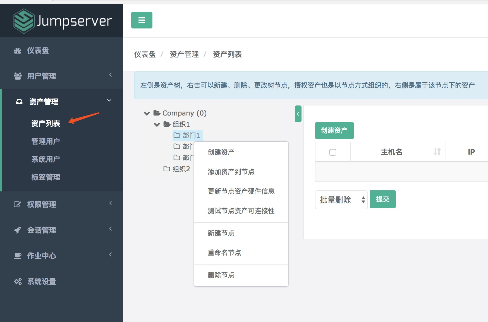

1.2 为资产树节点分配资产

在资产列表页面, 选择要添加资产的节点, 右键, 选择添加资产到节点。

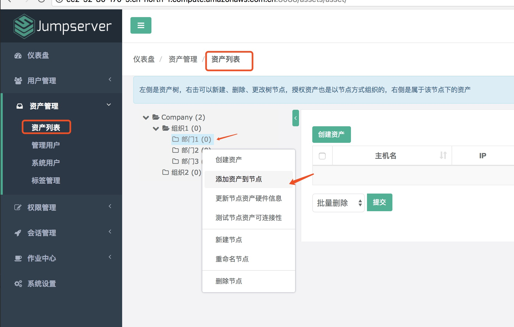

选择要被添加的资产, 点击"确认"即可。

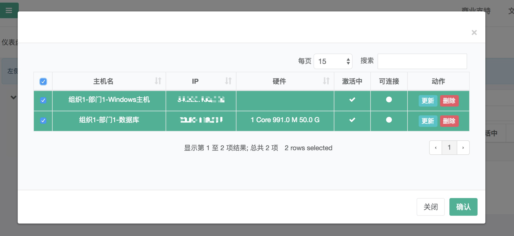

1.3 删除节点资产

选择要被删除的节点, 选择"从节点删除", 点击"提交"即可。

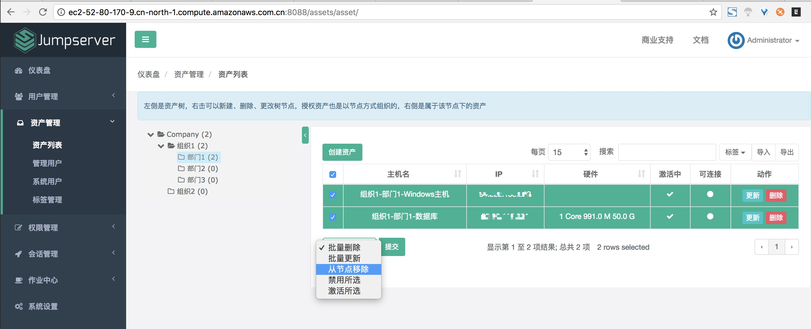

二、标签
````````````````

2.1 创建标签

点击页面左上角"创建标签"按钮, 进入创建标签页面：

给资产打上标签便于查询和管理。标签信息有名称和值：名称可以是描述功能信息, 例如：用途, 值则可以是具体信息, 例如：组织1-部门1-研发。标签创建的时候可以选择为已存在的资产打上该标签。

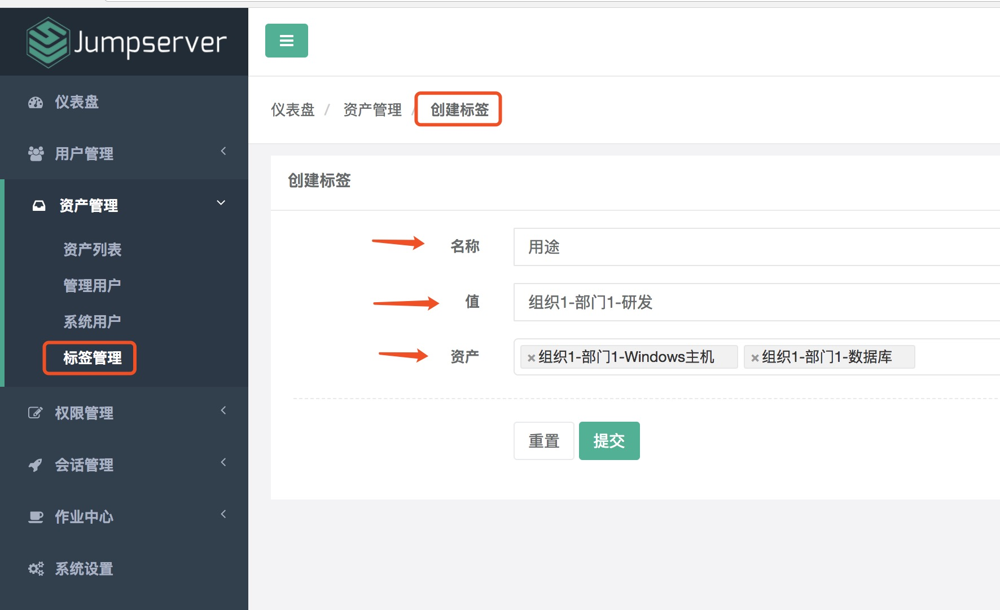

标签名称可以重名, 一个资产可以有多个标签产。标签删除, 资产上的标签信息会自动消失：

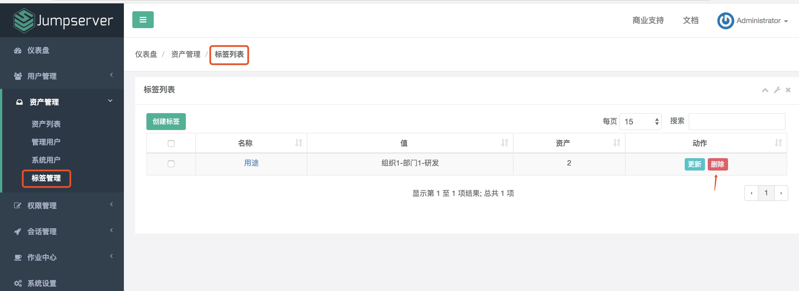

三、管理用户
`````````````````````

3.1 创建管理用户

管理用户是服务器的 root, 或拥有 NOPASSWD: ALL sudo 权限的用户, Jumpserver 使用该用户来推送系统用户、获取资产硬件信息等。

名称可以按资产树来命名。用户名 root。密码和 SSH 私钥必填一个。

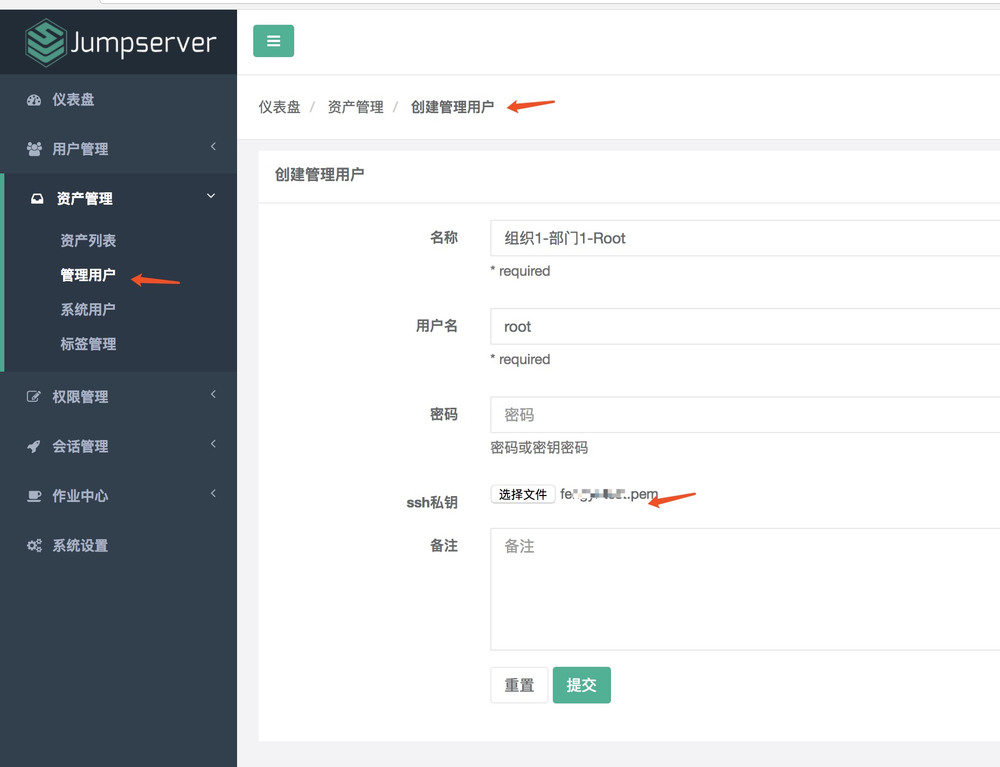

3.2 创建 Windows 管理用户

同 Linux 系统的管理用户一样, 名称可以按资产树来命名, 用户名是管理员用户名, 密码是管理员的密码。

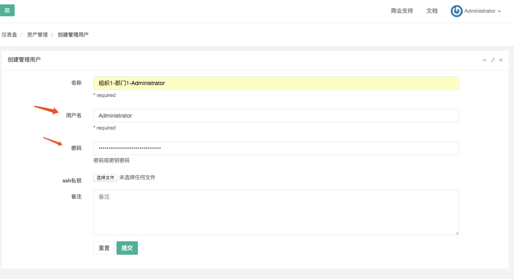

四、系统用户
`````````````````````

4.1 创建系统用户

系统用户是 Jumpserver 跳转登录资产时使用的用户, 可以理解为登录资产用户, 如 web, sa, dba('ssh web@some-host'), 而不是使用某个用户的用户名跳转登录服务器('ssh xiaoming@some-host'); 简单来说是 用户使用自己的用户名登录 Jumpserver, Jumpserver 使用系统用户登录资产。

系统用户创建时, 如果选择了自动推送 Jumpserver 会使用 Ansible 自动推送系统用户到资产中, 如果资产(交换机、Windows)不支持 Ansible, 请手动填写账号密码。

Linux 系统协议项务必选择 ssh 。如果用户在系统中已存在, 请去掉自动生成密钥、自动推送勾选。

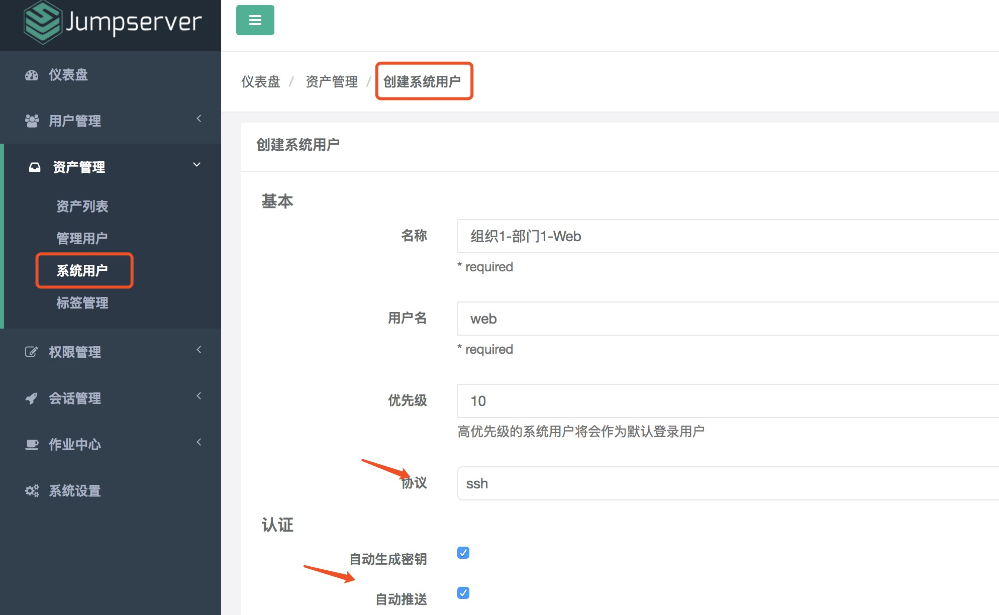

.. _update_admin_system_user:

4.2 创建 Windows 系统系统用户

由于目前 Windows 不支持自动推送, 所以 Windows 的系统用户设置成与管理用户同一个用户。

Windows 资产协议务必选择 rdp。

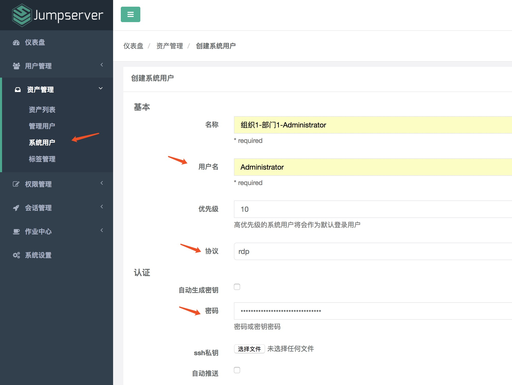

五、资产
````````````
5.1 创建资产

点击页面左侧的"资产管理"菜单下的"资产列表"按钮, 查看当前所有的资产列表。

点击页面左上角的"创建资产"按钮, 进入资产创建页面, 填写资产信息。

IP 地址和管理用户要确保正确, 确保所选的管理用户的用户名和密码能"牢靠"地登录指定的 IP 主机上。资产的系统平台也务必正确填写。公网 IP 信息只用于展示, 可不填, Jumpserver 连接资产主机使用的是 IP 信息。

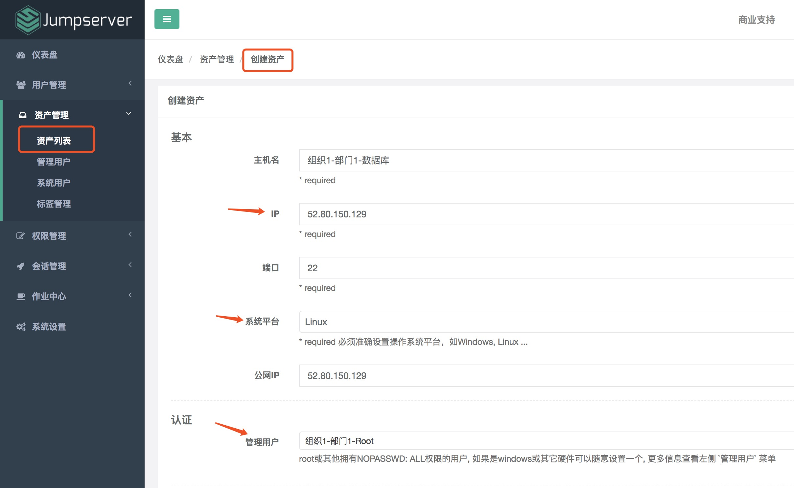

资产创建信息填写好保存之后, 可测试资产是否能正确连接：

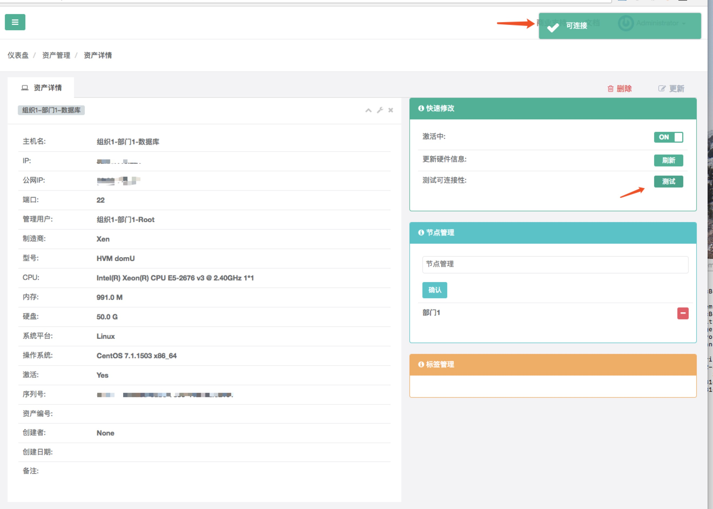

如果资产不能正常连接, 请检查管理用户的用户名和密钥是否正确以及该管理用户是否能使用 SSH 从 Jumpserver 主机正确登录到资产主机上。

5.2 创建 Windows 资产

同创建 Linux 资产一样。

创建 Windows 资产, 系统平台请选择正确的 Windows, 端口号为3389, IP 和 管理用户请正确选择, 确保管理用户能正确登录到指定的 IP 主机上。

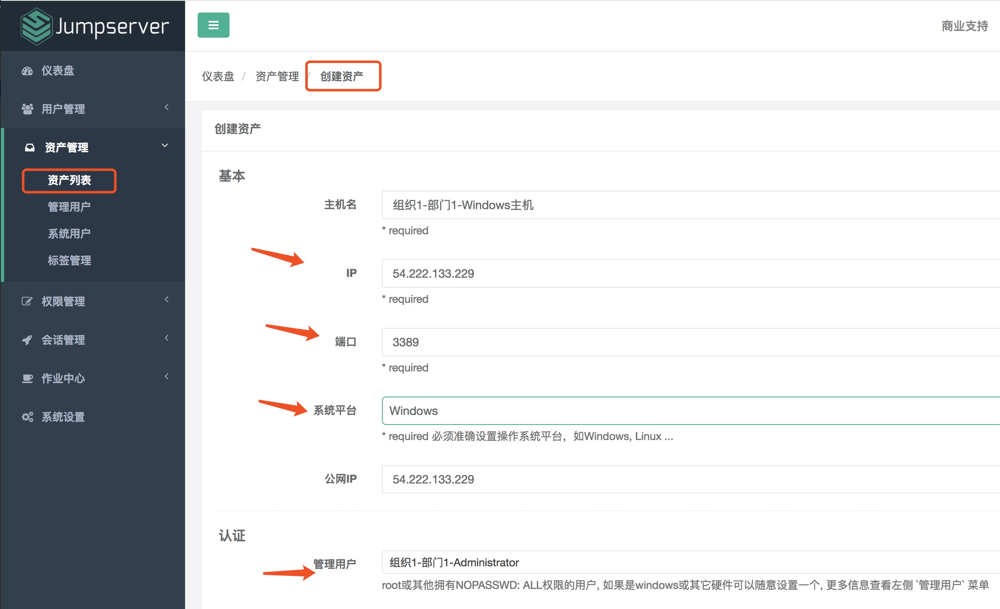
