资产管理
=============

一、资产列表
`````````````````

1.1 管理资产树

资产树节点不能重名, 右击节点可以添加、删除和重命名节点, 以及进行资产相关的操作

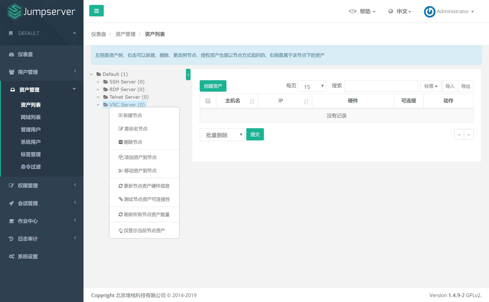

1.2 为资产树节点创建资产

在资产列表页面, 先在左侧选择资产要加入的节点, 然后在右侧选择创建资产

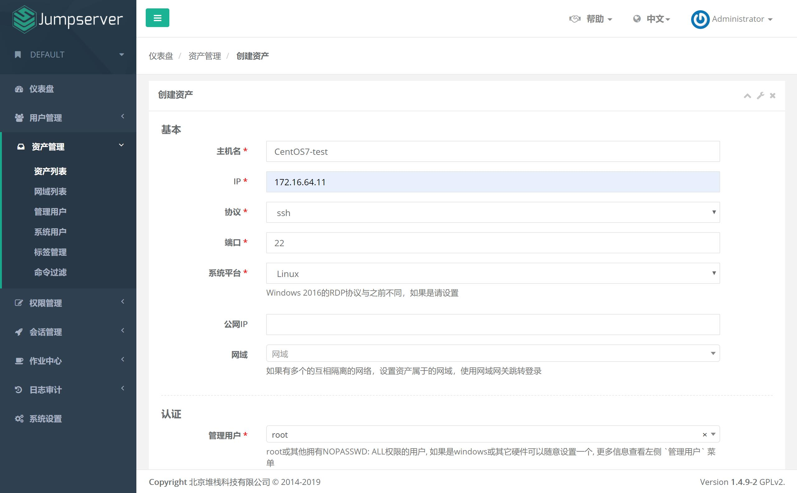

二、网域列表
`````````````````

网域功能是为了解决部分环境（如：混合云）无法直接连接而新增的功能，原理是通过网关服务器进行跳转登录

2.1 网域列表

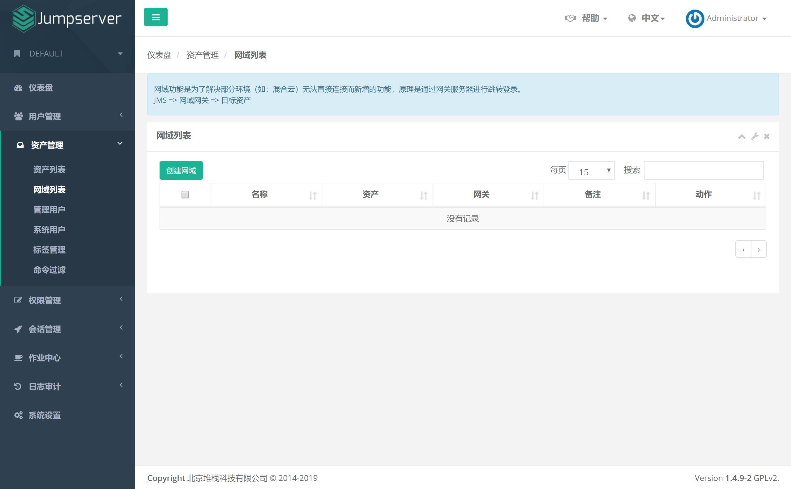

2.2 创建网域

在网域列表页面, 在右侧选择创建网域

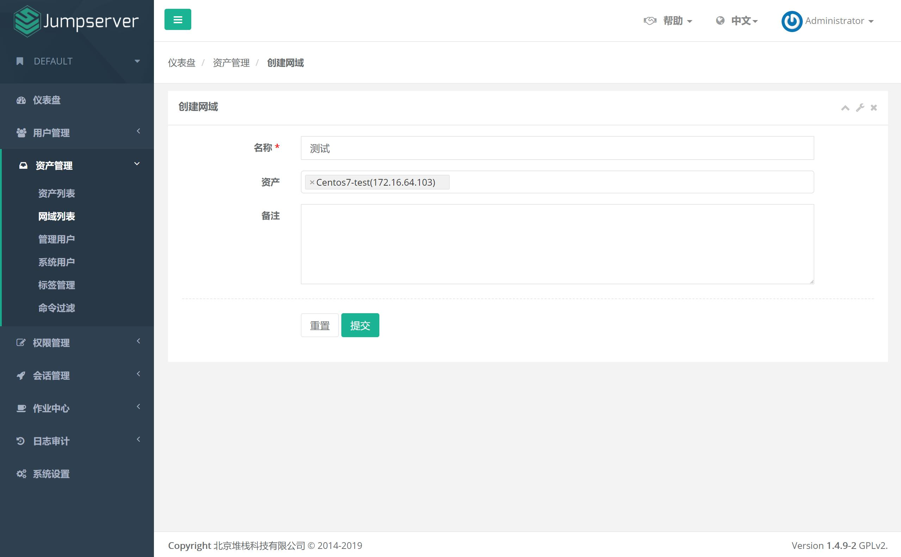

2.3 网关列表

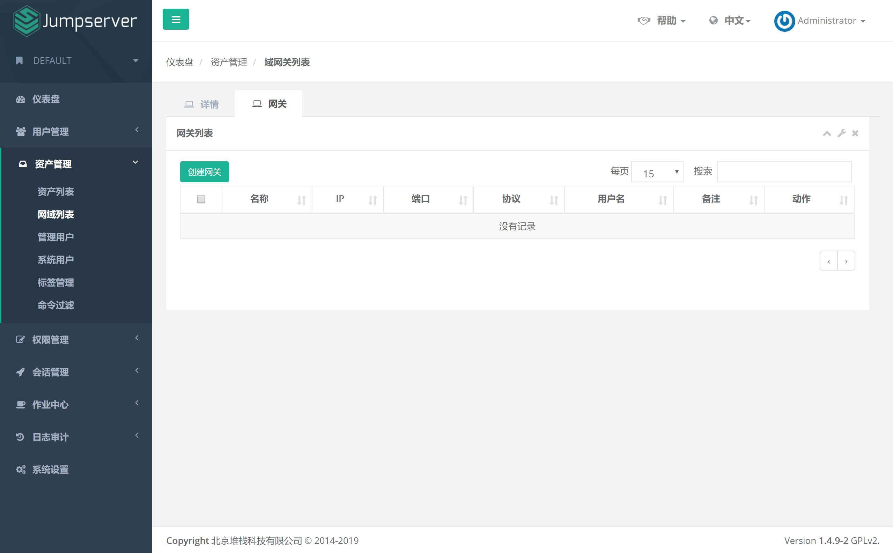

2.4 创建网关

在网域列表页面, 点击网关下面的数字进入网关列表, 点击创建网关, 网关可以是一台任意装有 ssh 服务的资产

.. image:: _static/img/admin_assets_domain_gateway_create.jpg

三、管理用户
`````````````````````

管理用户是资产（被控服务器）上的root，或拥有 NOPASSWD: ALL sudo权限的用户， Jumpserver使用该用户来 推送系统用户、获取资产硬件信息 等。暂不支持 Windows或其它硬件， 可以随意设置一个

3.1 管理用户列表

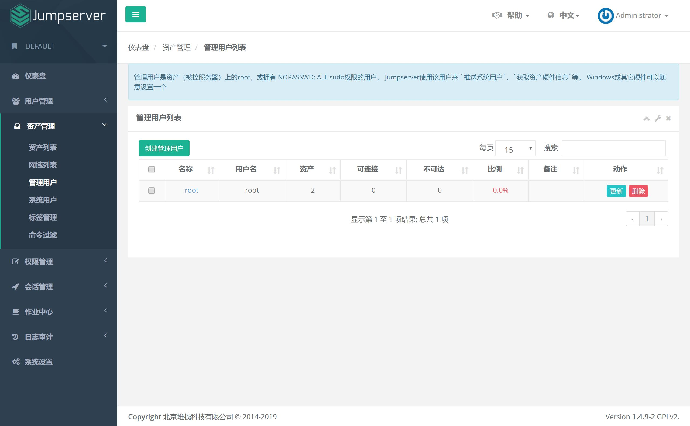

3.2 创建管理用户

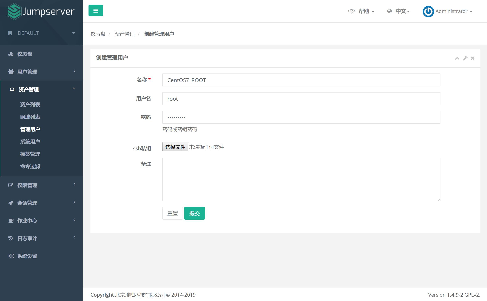

四、系统用户
`````````````````````

系统用户是 Jumpserver跳转登录资产时使用的用户，可以理解为登录资产用户，如 web, sa, dba(`ssh web@some-host`), 而不是使用某个用户的用户名跳转登录服务器(`ssh xiaoming@some-host`); 简单来说是 用户使用自己的用户名登录Jumpserver, Jumpserver使用系统用户登录资产。 系统用户创建时，如果选择了自动推送 Jumpserver会使用ansible自动推送系统用户到资产中，如果资产(交换机、windows)不支持ansible, 请手动填写账号密码。目前还不支持Windows的自动推送

4.1 系统用户列表

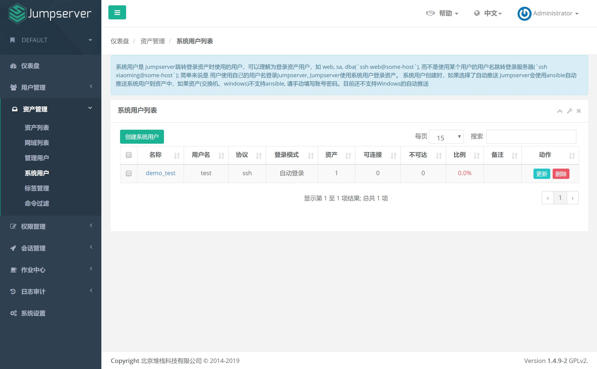

4.2 创建系统用户

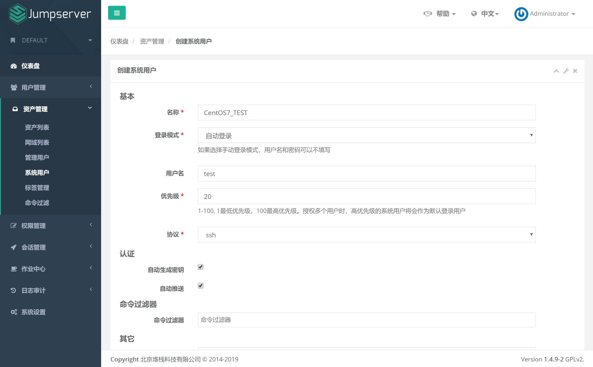
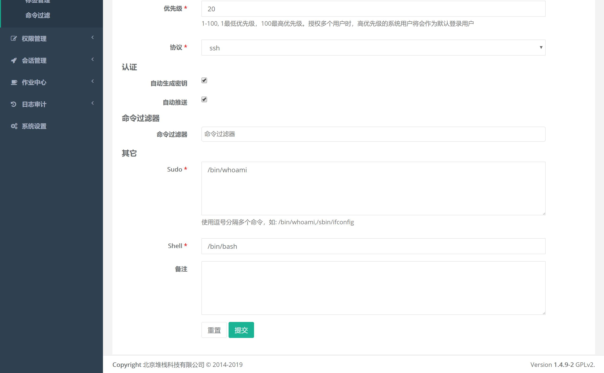

五、标签管理
````````````````

给资产打上标签便于查询和管理。标签信息有名称和值：名称可以是描述功能信息, 例如：用途, 值则可以是具体信息, 例如：组织1-部门1-研发。标签创建的时候可以选择为已存在的资产打上该标签。

5.1 标签列表

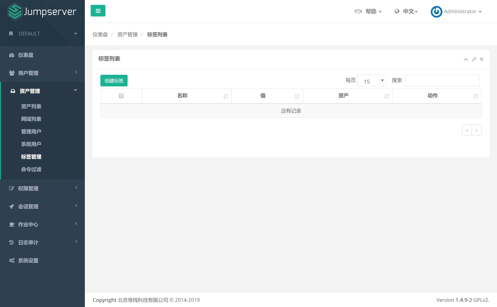

5.2 创建标签

点击页面左上角"创建标签"按钮, 进入创建标签页面：

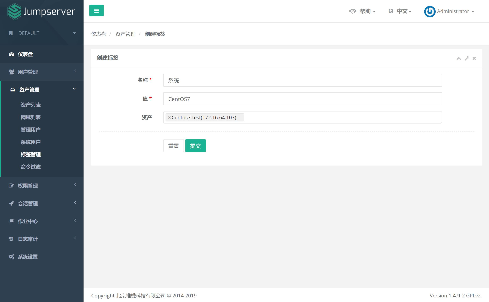

标签名称可以重名, 一个资产可以有多个标签产。标签删除, 资产上的标签信息会自动消失

六、命令过滤
````````````````

系统用户可以绑定一些命令过滤器，一个过滤器可以定义一些规则 当用户使用这个系统用户登录资产，然后执行一个命令 这个命令需要被绑定过滤器的所有规则匹配，高优先级先被匹配, 当一个规则匹配到了，如果规则的动作是 允许, 这个命令会被放行, 如果规则的动作是 禁止，命令将会被禁止执行, 否则就匹配下一个规则，如果最后没有匹配到规则，则允许执行

6.1 命令过滤器列表

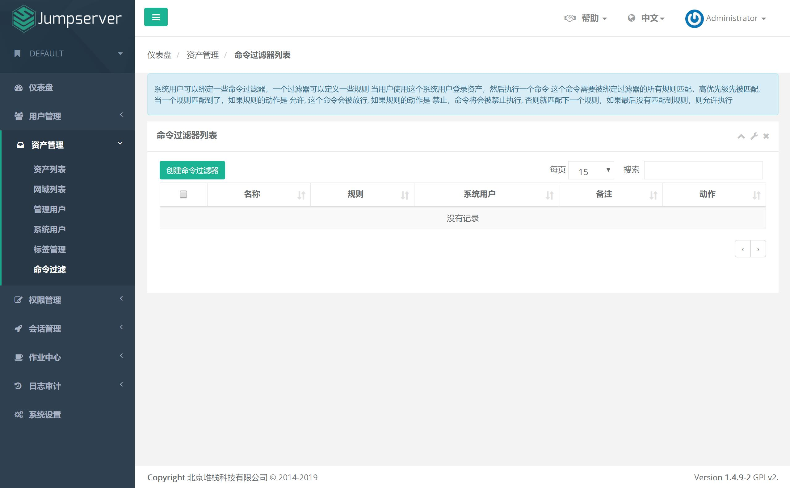

6.2 创建命令过滤器

在命令过滤器列表页面点击创建命令过滤器

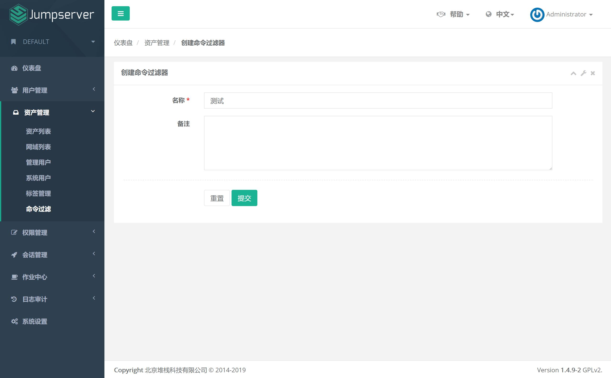

6.3 命令过滤器规则列表

在命令过滤器列表页面点击规则下面的数字进入规则页面

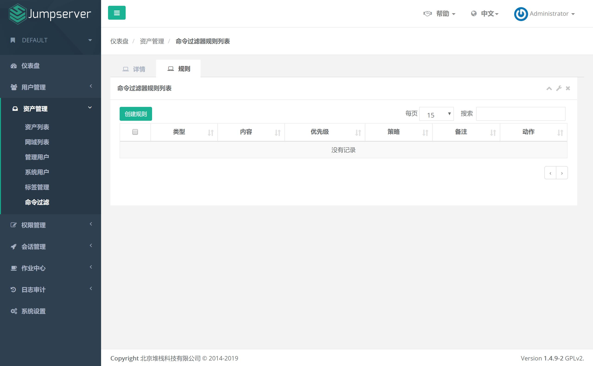

6.4 创建规则

在命令过滤器列表页面点击规则下面的数字进入规则页面, 点击创建规则

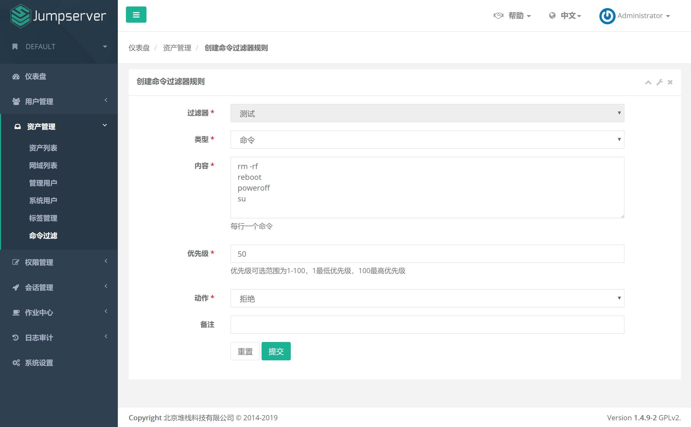
