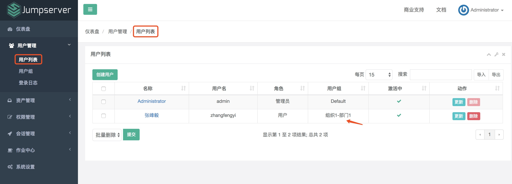

快速入门
==================

必备条件
````````````````

- 一台安装好 Jumpserver 系统的可用主机（堡垒机）
- 一台或多台可用的 Linux、Windows资产设备（被管理的资产）

一、系统设置
````````````````````

1.1 基本设置

.. image:: _static/img/basic_setting.jpg

1.2 配置邮件发送服务器

点击页面上边的"邮件设置" TAB ，进入邮件设置页面：

.. image:: _static/img/smtp_setting.jpg

配置 QQ 邮箱的 SMTP 服务可参考（http://blog.csdn.net/Aaron133/article/details/78363844），仅使用只需要看完第二部分即可。

配置邮件服务后，点击页面的"测试连接"按钮，如果配置正确，Jumpserver 会发送一条测试邮件到您的 SMTP 账号邮箱里面：

.. image:: _static/img/smtp_test.jpg

二、创建用户
`````````````````````

2.1 创建 Jumpserver 用户

点击页面左侧“用户列表”菜单下的“用户列表“，进入用户列表页面。

点击页面左上角“创建用户”按钮，进入创建用户页面，填写账户，角色安全，个人等信息。

其中，用户名即 Jumpserver 登录账号。用户组是用于资产授权，当某个资产对一个用户组授权后，这个用户组下面的所有用户就都可以使用这个资产了。角色用于区分一个用户是管理员还是普通用户。

.. image:: _static/img/create_jumpserver_user.jpg

成功提交用户信息后，Jumpserver 会发送一条设置"用户密码"的邮件到您填写的用户邮箱。

.. image:: _static/img/create_user_success.jpg

点击邮件中的设置密码链接，设置好密码后，您就可以用户名和密码登录 Jumpserver 了。

用户首次登录 Jumpserver，会被要求完善用户信息。基本信息可以不变，但 SSH 密钥信息必须填上。

Linux/Unix 生成 SSH 密钥可以参考（https://www.cnblogs.com/horanly/p/6604104.html)

Windows 生成 SSH 密钥可以参考（https://www.cnblogs.com/horanly/p/6604104.html)

查看公钥信息

::

    $ cat ~/.ssh/id_rsa.pub
    ssh-rsa AAAAB3NzaC1yc2EAAAADAQABAAABAQDadDXxxx......

复制 SSH 公钥，添加到 Jumpserver 中。

.. image:: _static/img/set_ssh_key.jpg


除了使用浏览器登录 Jumpserver 外，还可使用命令行登录：

确保 Coco 服务正常

.. image:: _static/img/coco_check.jpg

鉴于心态检测存在延迟，您也可以直接在 Jumpserver 主机上执行如下命令检测 Coco 是否存活，Coco 服务默认使用 2222 端口:

::

    $ netstat -ntpl

效果如下：

.. image:: _static/img/coco_check_terminal.jpg

命令行登录 Jumpserver 使用如下命令：

::

    $ ssh -p 2222 用户名@Jumpserver IP地址

登录成功后界面如下:

.. image:: _static/img/coco_success.jpg

三、创建资产
``````````````````

3.1 创建 Linux 资产

3.1.1 编辑资产树

节点不能重名，右击节点可以添加、删除和重命名节点，以及进行资产相关的操作。

.. image:: _static/img/asset_tree.jpg

3.1.2 创建管理用户

管理用户是服务器的 root，或拥有 NOPASSWD: ALL sudo 权限的用户，Jumpserver 使用该用户来推送系统用户、获取资产硬件信息等。


如果使用ssh私钥，需要先在资产上设置，这里举个例子供参考（本例登录资产使用root为例）

::

    (1). 在资产上生成 root 账户的公钥和私钥

      $ ssh-keygen -t rsa  # 默认会输入公钥和私钥文件到 ~/.ssh 目录

    (2). 将公钥输出到文件 authorized_keys 文件，并修改权限

      $ cat ~/.ssh/id_rsa.pub >> ~/.ssh/authorized_keys
      $ chmod 400 ~/.ssh/authorized_keys

    (3). 打开RSA验证相关设置

      $ vim /etc/ssh/sshd_config

      RSAAuthentication yes
      PubkeyAuthentication yes
      AuthorizedKeysFile     .ssh/authorized_keys

    (4). 重启 ssh 服务
      $ service sshd restart

    (5). 上传 ~/.ssh 目录下的 id_rsa 私钥到 jumpserver 的管理用户中

这样就可以使用 ssh私钥 进行管理服务器。

名称可以按资产树来命名。用户名root。密码和 SSH 私钥必填一个。

.. image:: _static/img/create_asset_admin_user.jpg

3.1.3 创建系统用户

系统用户是 Jumpserver 跳转登录资产时使用的用户，可以理解为登录资产用户，如 web, sa, dba(`ssh web@some-host`), 而不是使用某个用户的用户名跳转登录服务器(`ssh xiaoming@some-host`); 简单来说是 用户使用自己的用户名登录Jumpserver, Jumpserver使用系统用户登录资产。

系统用户的 Sudo 栏填写允许当前系统用户免sudo密码执行的程序路径，如默认的/sbin/ifconfig，意思是当前系统用户可以直接执行 ifconfig 命令或 sudo ifconfig 而不需要输入当前系统用户的密码，执行其他的命令任然需要密码，以此来达到权限控制的目的。

::

    # 这里简单举几个例子
    Sudo /bin/su  # 当前系统用户可以免sudo密码执行sudo su命令（也就是可以直接切换到root，生产环境不建议这样操作）
    Sodu /usr/bin/git,/usr/bin/php,/bin/cat,/bin/more,/bin/less,/usr/bin/head,/usr/bin/tail  # 当前系统用户可以免sudo密码执行git php cat more less head tail

    # 此处的权限应该根据使用用户的需求汇总后定制，原则上给予最小权限即可。

系统用户创建时，如果选择了自动推送 Jumpserver 会使用 Ansible 自动推送系统用户到资产中，如果资产(交换机、Windows )不支持 Ansible, 请手动填写账号密码。

Linux 系统协议项务必选择 ssh 。如果用户在系统中已存在，请去掉自动生成密钥、自动推送勾选。

.. image:: _static/img/create_asset_system_user.jpg

3.1.4 创建资产

点击页面左侧的“资产管理”菜单下的“资产列表”按钮，查看当前所有的资产列表。

点击页面左上角的“创建资产”按钮，进入资产创建页面，填写资产信息。

IP 地址和管理用户要确保正确，确保所选的管理用户的用户名和密码能"牢靠"地登录指定的 IP 主机上。资产的系统平台也务必正确填写。公网 IP 信息只用于展示，可不填，Jumpserver 连接资产使用的是 IP 信息。

.. image:: _static/img/create_asset.jpg

资产创建信息填写好保存之后，可测试资产是否能正确连接：

.. image:: _static/img/check_asset_connect.jpg

如果资产不能正常连接，请检查管理用户的用户名和密钥是否正确以及该管理用户是否能使用 SSH 从 Jumpserver 主机正确登录到资产主机上。

3.2 创建 Windows 资产

3.2.1 创建 Windows 系统管理用户

同 Linux 系统的管理用户一样，名称可以按资产树来命名，用户名是管理员用户名，密码是管理员的密码。

.. image:: _static/img/create_windows_admin.jpg

3.2.2 创建 Windows 系统系统用户

目前 Windows 暂不支持自动推送，用户必须在系统中存在且有权限使用远程连接，请去掉自动生成密钥、自动推送勾选；请确认 windows 资产的 rdp 防火墙已经开放。

Windows 资产协议务必选择 rdp。

.. image:: _static/img/create_windows_user.jpg

3.2.3 创建 Windows 资产

同创建 Linux 资产一样。

创建 Windows 资产，系统平台请选择正确的 Windows，端口号为3389，IP 和 管理用户请正确选择，确保管理用户能正确登录到指定的 IP 主机上。

.. image:: _static/img/create_windows_asset.jpg

四、资产节点管理
``````````````````````

4.1 为资产树节点分配资产

在资产列表页面，选择要添加资产的节点，右键，选择添加资产到节点。

.. image:: _static/img/add_asset_to_node.jpg

选择要被添加的资产，点击"确认"即可。

.. image:: _static/img/select_asset_to_node.jpg

4.2 删除节点资产

选择要被删除的节点，选择"从节点删除"，点击"提交"即可。

.. image:: _static/img/delete_asset_from_node.jpg

五、创建授权规则
`````````````````````

节点，对应的是资产，代表该节点下的所有资产。

用户组，对应的是用户，代表该用户组下所有的用户。

系统用户，及所选的用户组下的用户能通过该系统用户使用所选节点下的资产。

节点，用户组，系统用户是一对一的关系，所以当拥有 Linux、Windows 不同类型资产时，应该分别给 Linux 资产和 Windows 资产创建授权规则。

.. image:: _static/img/create_auth_rules.jpg

创建的授权规节点要与资产所在的节点一致。

.. image:: _static/img/auth_rule_list.jpg

六、用户使用资产
`````````````````````

6.1 登录 Jumpserver

创建授权规则的时候，选择了用户组，所以这里需要登录所选用户组下面的用户才能看见相应的资产。



用户正确登录后的页面：

.. image:: _static/img/user_login_success.jpg

6.2 使用资产

6.2.1 连接资产

点击页面左边的 Web 终端：

.. image:: _static/img/link_web_terminal.jpg

打开资产所在的节点：

.. image:: _static/img/luna_index.jpg

双击资产名字，就连上资产了：

如果显示连接超时，请检查为资产分配的系统用户用户名和密钥是否正确，是否正确选择 Windows 操作系统，协议 rdp，端口3389，是否正确选择 Linux 操作系统，协议 ssh，端口22，以及资产的防火墙策略是否正确配置等信息。

.. image:: _static/img/windows_assert.jpg

接下来，就可以对资产进行操作了。

6.2.2 断开资产

点击页面顶部的 Server 按钮会弹出选个选项，第一个断开所选的连接，第二个断开所有连接。

.. image:: _static/img/disconnect_assert.jpg

以上就是 Jumpserver 的简易入门了，Jumpserver 还有很多功能等待您去发现。在使用过程中，如果遇到什么问题，可以在文档的"联系方式"一栏找到我们。
