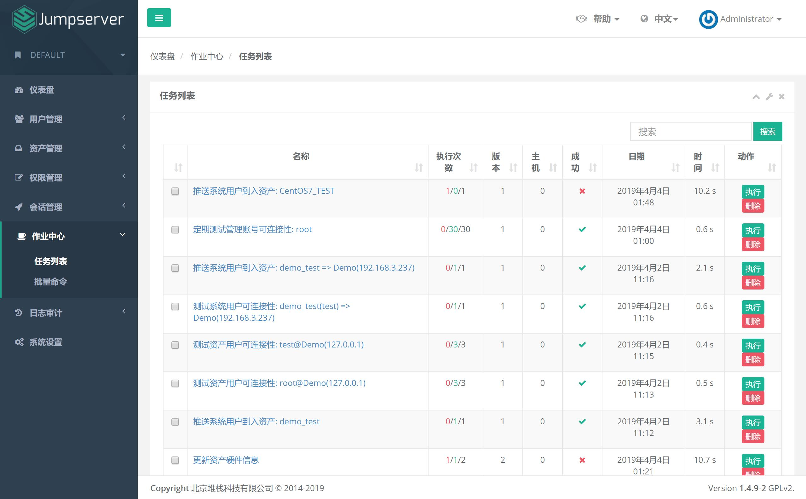
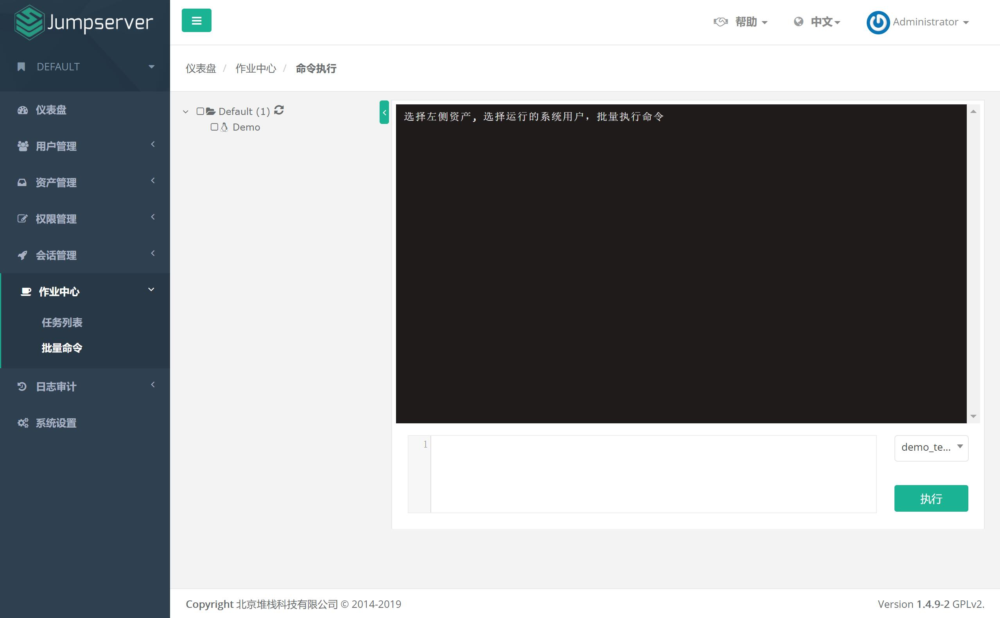

作业中心
==============

一、任务列表
`````````````````````

作业是 Jumpserver 向其所管理下的资产发送的指令, 例如, 测试资产可连接性、获取资产硬件信息、测试管理用户可连接性和测试系统用户可连接性等命令。默认展示最近7天的作业记录。



点击作业名称可以查看作业的具体详情、作业的历史版本以及作业执行的历史记录

二、批量命令
`````````````````````

可以通过该功能快速下发命令到资产, 目前仅支持能被 ansible 管理的资产, 要求 系统用户 登陆方式为 自动登陆


