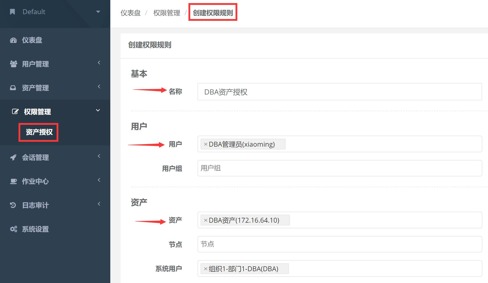
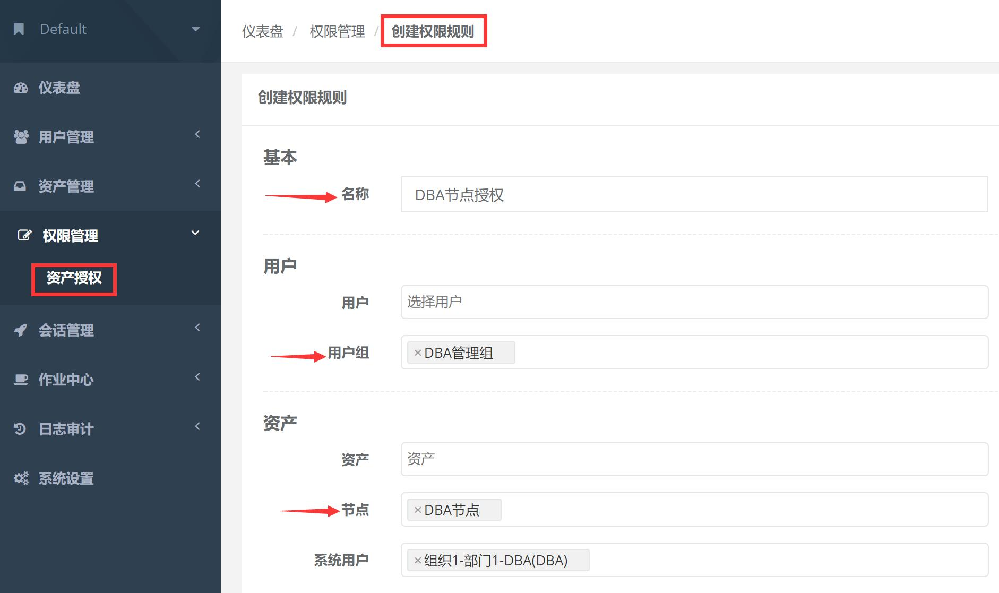

权限管理
===================

一、资产授权
`````````````````````

1.1 创建授权规则

节点, 对应的是资产, 代表该节点下的所有资产。

用户组, 对应的是用户, 代表该用户组下所有的用户。

系统用户, 及所选的用户组下的用户能通过该系统用户使用所选节点下的资产。

节点, 用户组, 系统用户是一对一的关系, 所以当拥有 Linux、Windows 不同类型资产时, 应该分别给 Linux 资产和 Windows 资产创建授权规则。

资产授权与节点授权的区别请参考下面示例, 一般情况下, 资产授权给个人, 节点授权给用户组, 一个授权只能选择一个系统用户



