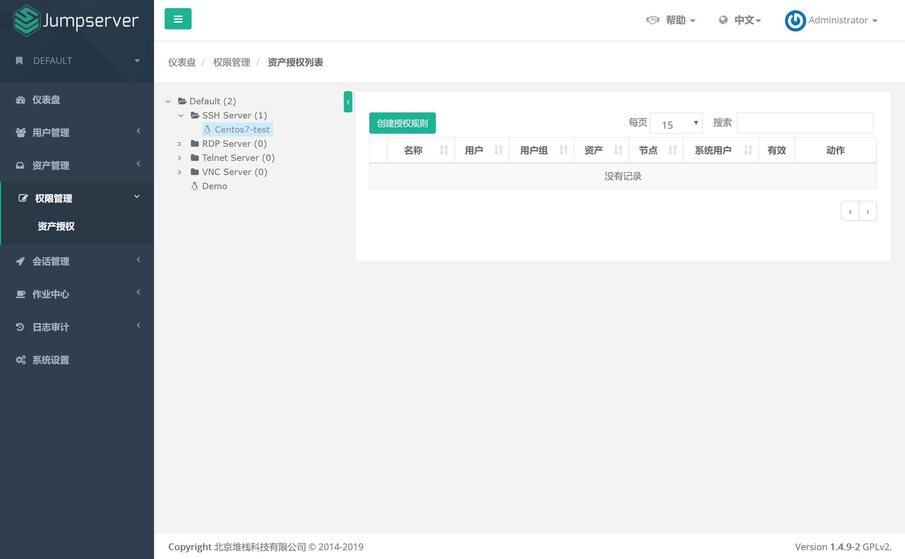
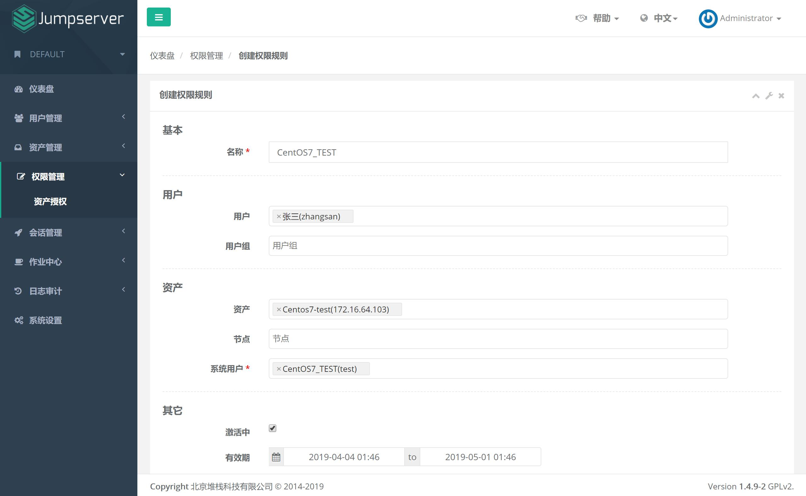

权限管理
===================

一、资产授权
`````````````````````

把资产授权给用户后, 用户才能在 "我的资产" 里面看到资产, 配置正确后用户才能正常连接资产

1.1 查看授权列表



1.2 创建授权规则

节点, 对应的是资产, 代表该节点下的所有资产。

用户组, 对应的是用户, 代表该用户组下所有的用户。

系统用户, 及所选的用户组下的用户能通过该系统用户使用所选节点下的资产。

节点, 用户组, 系统用户是一对一的关系, 所以当拥有 Linux、Windows 不同类型资产时, 应该分别给 Linux 资产和 Windows 资产创建授权规则。

资产或节点可以授权给个人或用户组, 一个授权建议只指定一个系统用户 (多系统用户会按照优先级进行排序, 高优先自动登陆, 同时存在多个并级系统用户时，用户需要自己选择系统用户)


