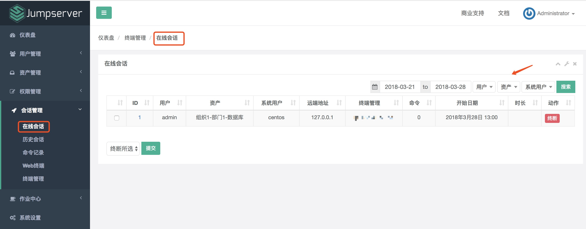
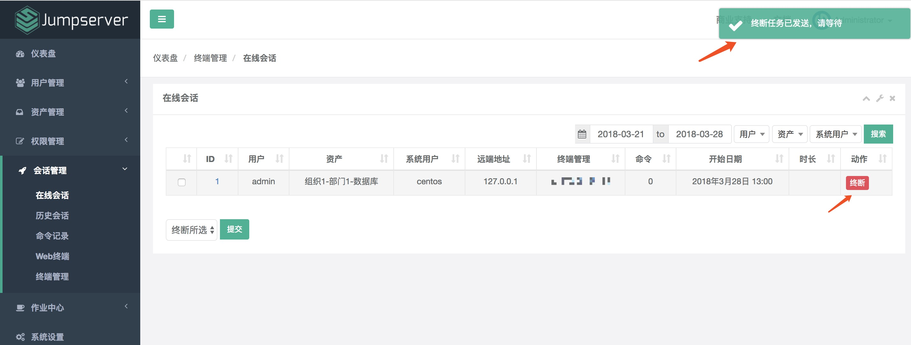
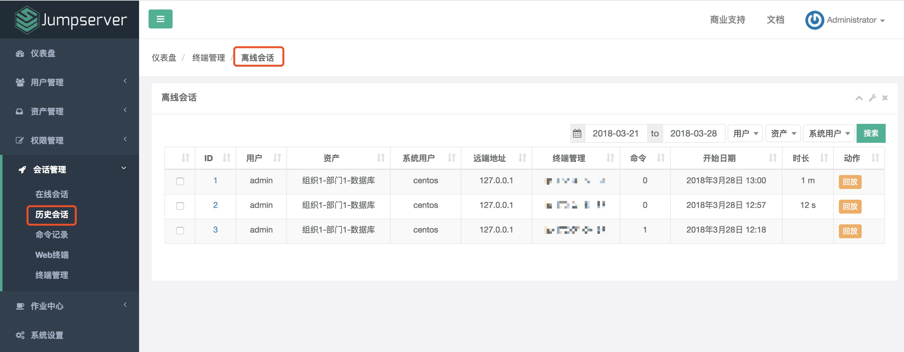
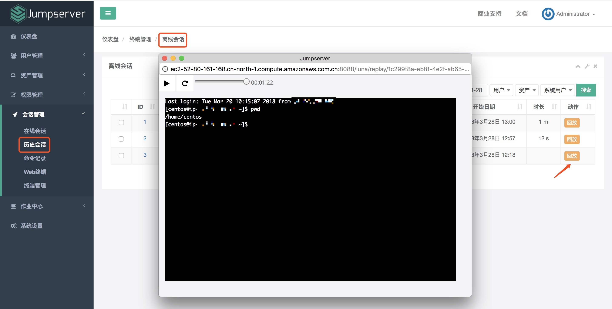
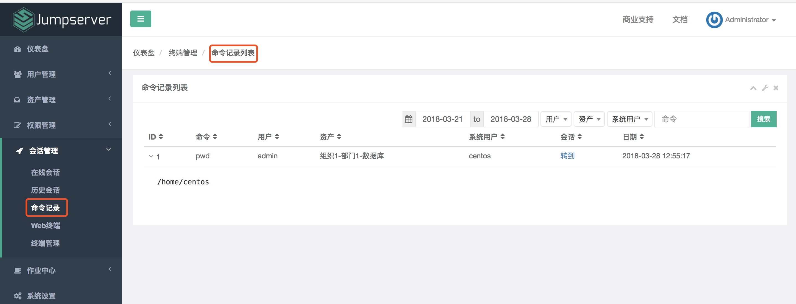
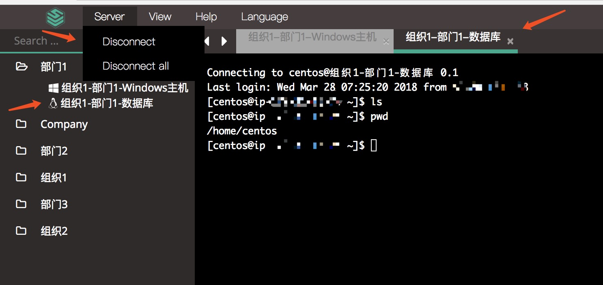
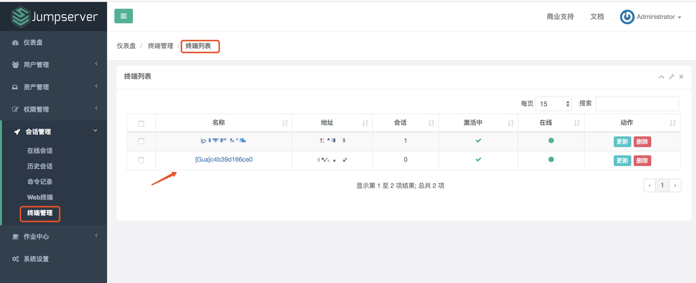

会话管理
==============

一、在线会话
````````````````````

1.1 查看在线会话

点击页面左侧"会话管理"菜单下的"在线会话"按钮, 进入在线会话列表页面, 默认展示最近7天的记录。

目前还不支持 Windows 系统, 正在努力开发中......

::

    用户：在线的用户名。

    资产：登录的资产名称。

    系统用户：用户使用那哪个系统用户登录的资产。

    远端地址：登录用户的 IP 地址。

    终端地址：登录所以使用的终端的 IP 地址, 列如 Coco。

    命令: 用户执行了多少条命令。

    开始日期: 登录的时间。

    时长：在线时长。



可以查看指定的在线记录, 比如, 指定用户、资产或系统用户。

1.2 中断会话

管理员可以手动中断当前在线的会话。



已中断的会话会记录到"历史会话"里面。


二、历史会话
`````````````````````

2.1 查看历史会话

历史会话同在线会话包含的信息一样, 都有用户、资产和 IP 地址等信息。



2.2 查看历史话录像

Jumpserver 提供历史会话的录像观看。点击左侧的"回放"按钮, 即可观看录像。



三、命令记录
```````````````````````

命令记录里面存放的是用户在资产上执行过哪些命令, 单击一行记录, 会展示命令执行的结果：



点击"转到"连接, 会跳转到详细的会话页面, 如果会话已结束可以查看会话录像, 如果会话正在线可中断会话：

.. image:: _static/img/admin_session_command_detail.jpg

四、Web 终端
``````````````````````````

Web 终端是资产使用界面, 管理员和用户都是从这里登录到资产上, 执行操作。点击资产名字连接资产, 点击"Server"下的"Disconnect"断开资产连接。



五、文件管理
```````````````````````

文件管理允许对 SSH 协议资产进行文件上传下载创建删除操作(不支持上传文件夹), 目前也不支持系统用户是手动登录的资产

六、终端管理
```````````````````````

终端列表页面列出了 Jumpserver 正在使用的终端有哪些, 例如：Coco、Gua 等。终端第一次使用, 会首先向 Jumpserver 发送请求注册, 在 Jumpserver 中接受注册后就可以正常使用该终端了。


