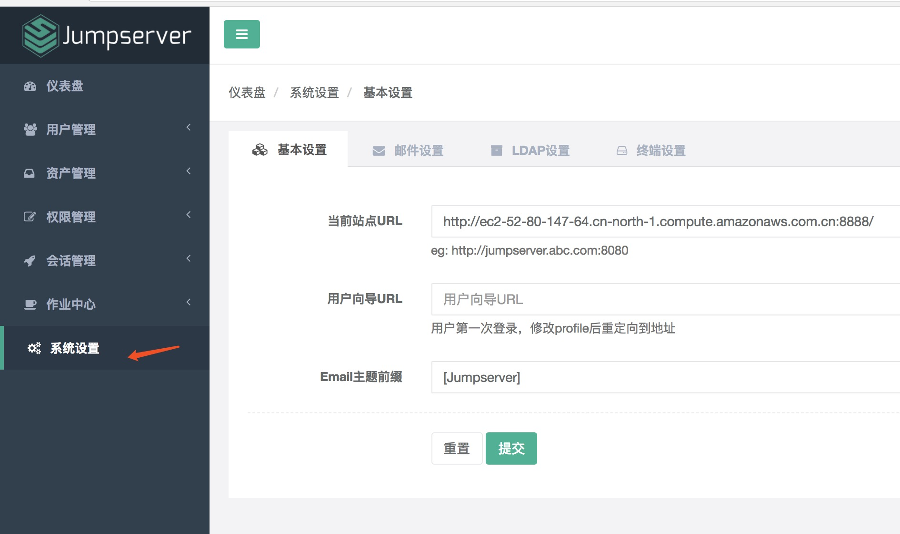
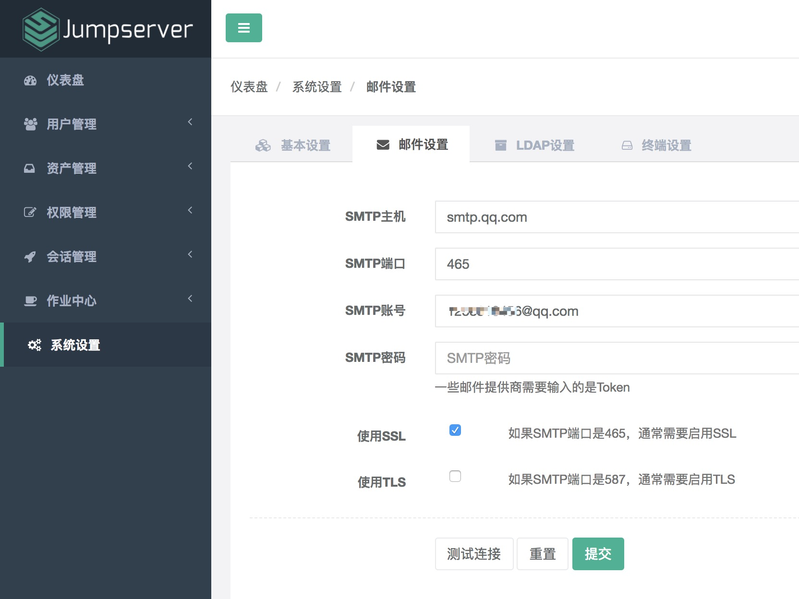
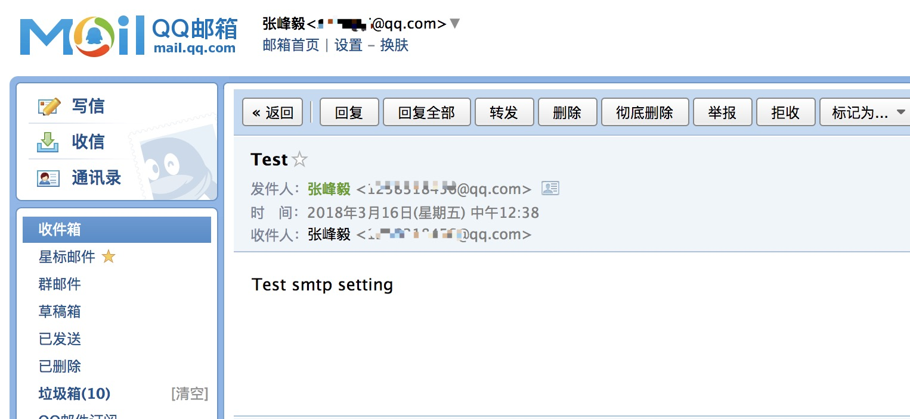
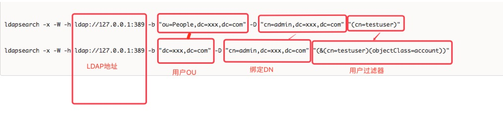
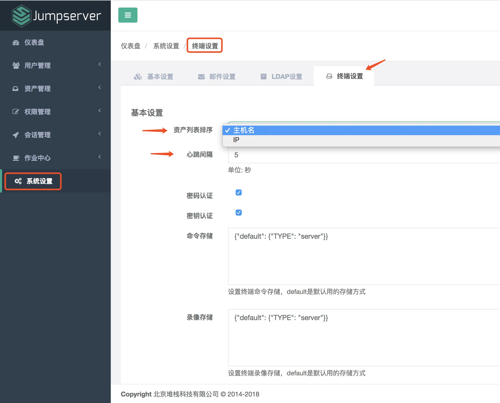

系统设置
=============

点击页面左侧"系统设置"按钮, 进入系统设置页面, 查看基本设置、邮件设置、LDAP 设置和终端设置等内容。

.. _basic_settings:

一、基本设置
`````````````````````

点击页面上边的"基本设置" TAB, 进入基本设置页面, 编辑当前站点 URL、用户想到 URL、Email 主题前缀等信息, 点击"提交"按钮, 基本设置完成。



二、邮件设置
````````````````````

点击页面上边的"邮件设置" TAB, 进入邮件设置页面：



配置 QQ 邮箱的 SMTP 服务可参考(http://blog.csdn.net/Aaron133/article/details/78363844)

配置邮件服务后, 点击页面的"测试连接"按钮, 如果配置正确, Jumpserver 会发送一条测试邮件到您的 SMTP 账号邮箱里面：



三、LDAP 设置
````````````````````````

点击页面上边的" LDAP 设置" TAB, 进入 LDAP 设置页面, 编辑 LDAP 地址、DN、用户 OU、用户过滤器、LDAP 属性映射和是否使用 SSL、是否启用 LDAP 认证等信息, 点击"测试连接"按钮, 测试是否正确设置, 点击"提交"按钮, 完成 LDAP 设置。

如果这里有问题请手动用 ldapsearch命令测试一下, 如果能唯一搜索出这个用户代表你的设置是对的, 然后根据用户的属性填写映射关系



::

   # 注意下面的 testuser对应的是你ldap server上存在的用户, 填写到配置中需要改为 %(user)s
   ldapsearch -x -W -H ldap://127.0.0.1:389 -b "ou=People,dc=xxx,dc=com" -D "cn=admin,dc=xxx,dc=com" "(cn=testuser)"
   ldapsearch -x -W -H ldap://127.0.0.1:389 -b "dc=xxx,dc=com" -D "cn=admin,dc=xxx,dc=com" "(&(cn=testuser)(objectClass=account))"

   # extended LDIF
   #
   # LDAPv3
   # base <ou=People,dc=xxx,dc=com> with scope subtree
   # filter: (cn=*)
   # requesting: ALL
   #

   # testuser, People, xxx.com
   dn: uid=testuser,ou=People,dc=xxx,dc=com
   uid: testuser       # 打算使用该属性映射为jumpserver username
   cn: testuser        # 打算使用该属性映射为jumpserver name
   mail: xyz@google.coom   # 打算使用该属性映射为jumpserver email
   objectClass: account
   objectClass: posixAccount
   objectClass: top
   objectClass: shadowAccount
   ...

四、终端设置
````````````````````

点击页面上边的"终端设置" TAB, 进入终端设置页面, 编辑终端信息, 点击"提交"按钮, 终端设置完成。

资产列表排序项, 可以选择按主机名或者 IP 来排序, 默认是按主机名排序。心跳间隔指的是 Coco 和 Gua 等终端向 Jumpserver 发送心跳信息的频率, 如果 Jumpserver 长时间(1个小时)未收到 Coco 和 Gua 发送的心跳数据, Jumpserver 则认为该终端也"死掉", 在"会话管理"下的"终端管理"页面会显示该终端已掉线。


