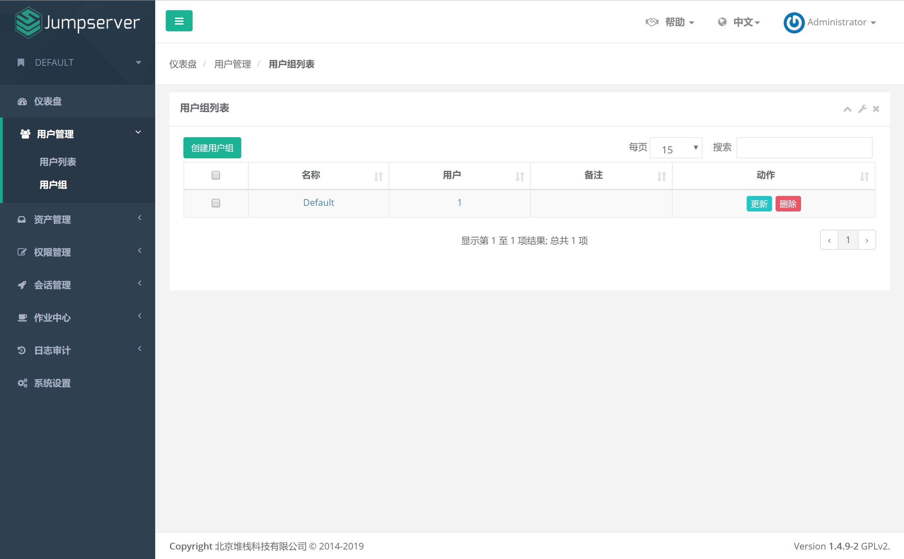
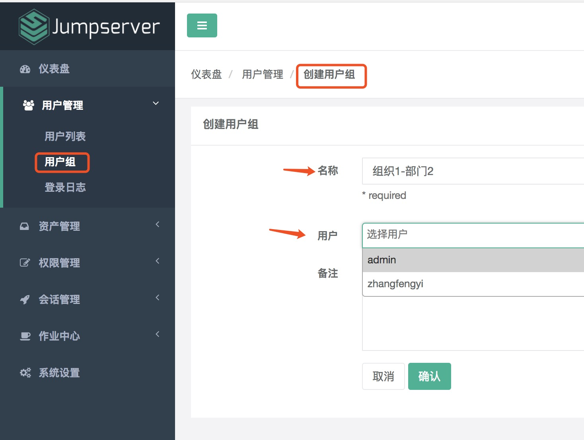
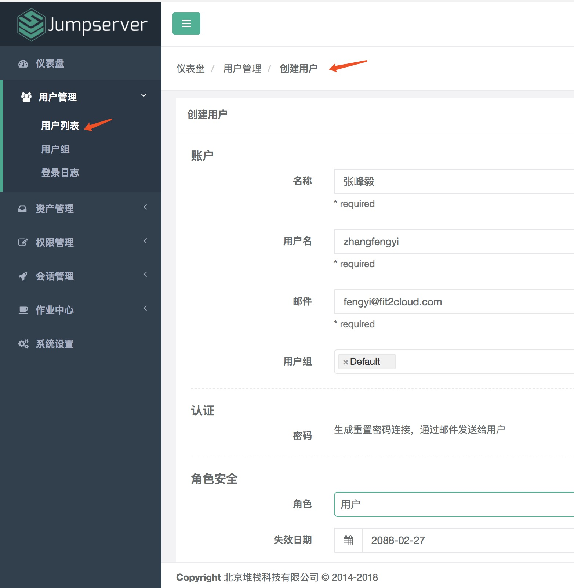
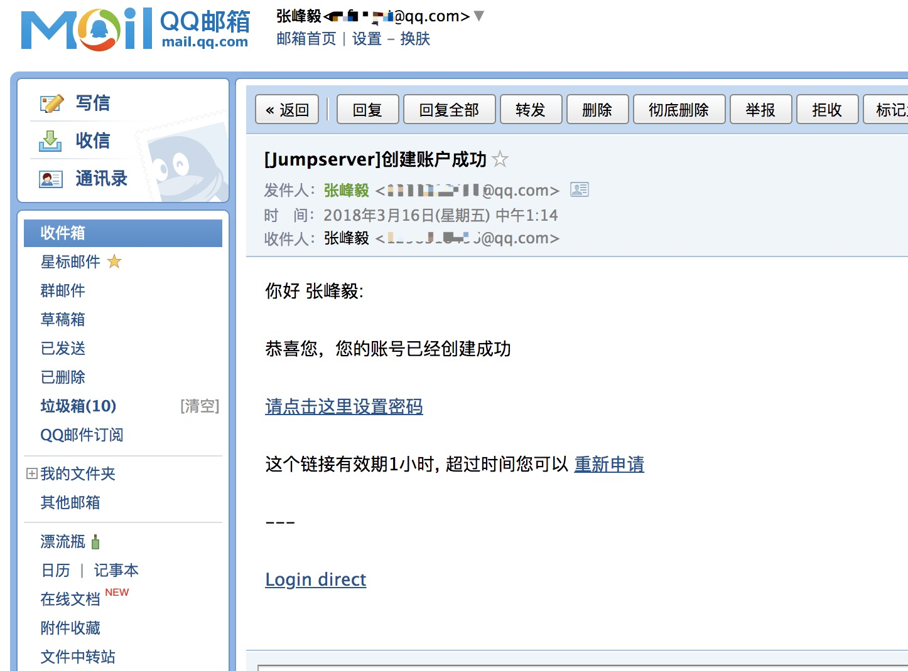
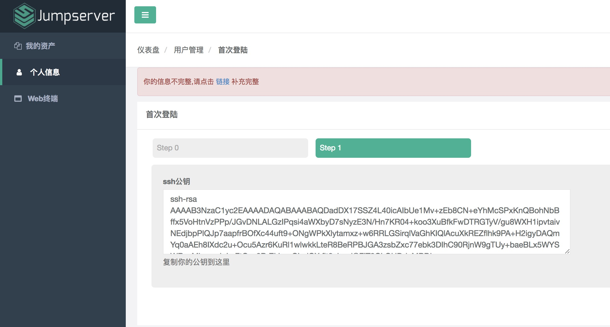
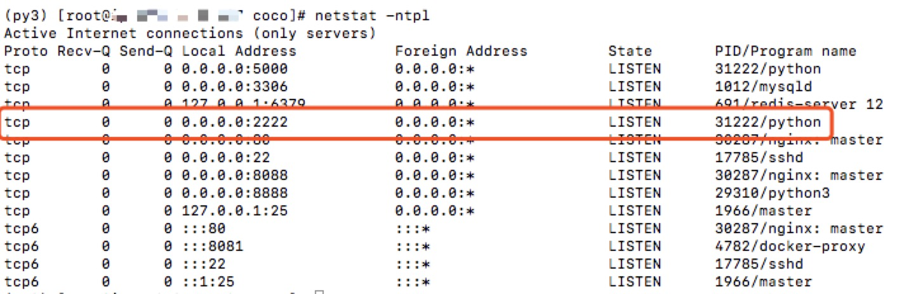
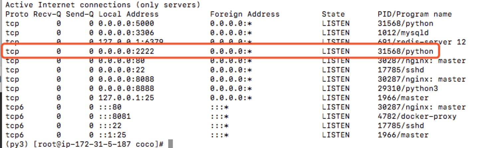
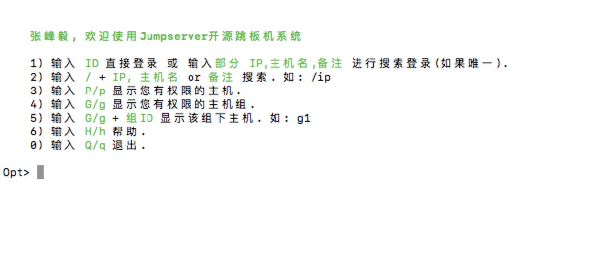
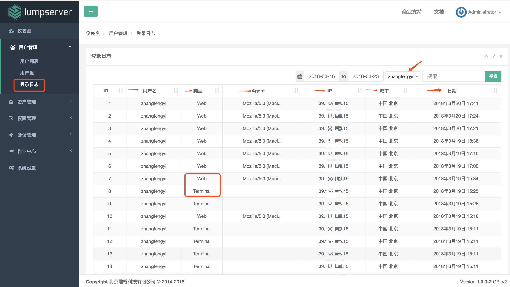

用户管理
=============

一、用户组
````````````````

1.1 创建用户组

用户组, 顾名思义, 给用户分组。用户组信息很有用, 在分配资产权限的时候, 针对的某个用户组下的所有用户, 可以为一个用户分配多个用户组。

点击页面左侧"用户管理"菜单下的"用户组", 进入用户组列表页面。



点击页面左上角"创建用户组"按钮, 进入创建用户组页面：

名称即用户组名称, 建议填写简单明了有用的信息。创建用户组的时候可以把已存在的用户加入到该分组中, 一个用户可以存在多个分组中。



二、用户
```````````````````
2.1 创建用户

点击页面左侧"用户列表"菜单下的"用户列表", 进入用户列表页面。

点击页面左上角"创建用户"按钮, 进入创建用户页面, 填写账户, 角色安全, 个人等信息。

其中, 用户名即 Jumpserver 登录账号。用户组是用于资产授权, 当某个资产对一个用户组授权后, 这个用户组下面的所有用户就都可以使用这个资产了。角色用于区分一个用户是管理员还是普通用户。



成功提交用户信息后, Jumpserver 会发送一条设置"用户密码"的邮件到您填写的用户邮箱。



点击邮件中的设置密码链接, 设置好密码后, 您就可以用户名和密码登录 Jumpserver 了。

用户首次登录 Jumpserver, 会被要求完善用户信息。

Linux/Unix 生成 SSH 密钥可以参考(https://www.cnblogs.com/horanly/p/6604104.html)

Windows 生成 SSH 密钥可以参考(https://www.cnblogs.com/horanly/p/6604104.html)

查看公钥信息：

::

    $ cat ~/.ssh/id_rsa.pub
    ssh-rsa AAAAB3NzaC1yc2EAAAADAQABAAABAQDadDXxxx......

复制 SSH 公钥, 添加到 Jumpserver 中。




除了使用浏览器登录 Jumpserver 外, 还可使用命令行登录：

确保 Coco 服务正常



鉴于心态检测存在延迟, 您也可以直接在 Jumpserver 主机上执行如下命令检测 Coco 是否存活, Coco 服务默认使用 2222 端口:

::

    $ netstat -ntpl

效果如下：



命令行登录 Jumpserver 使用如下命令：

::

    $ ssh -p 2222 用户名@Jumpserver IP地址

登录成功后界面如下:



三、登录日志
````````````````````

3.1 查看登录日志

登录日志, 记录 Jumpserver 用户的登录信息, 包含用户名、类型：通过网页登录(Web)还是终端登录(Terminal)、Agent：所用代理、登录的 IP 地址、登录的地点以及登录日期。

还可以指定某一用户, 查询其登录的历史记录。

点击页面左侧"用户管理"菜单下的"登录日志"按钮, 进入登录日志页面：


