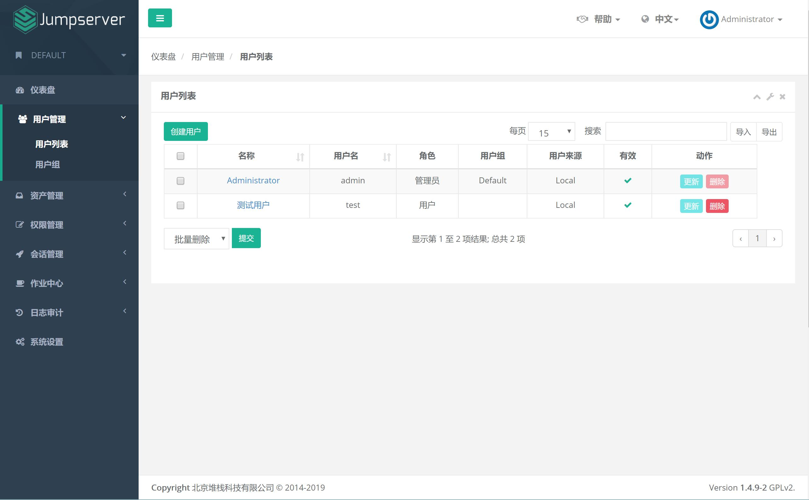
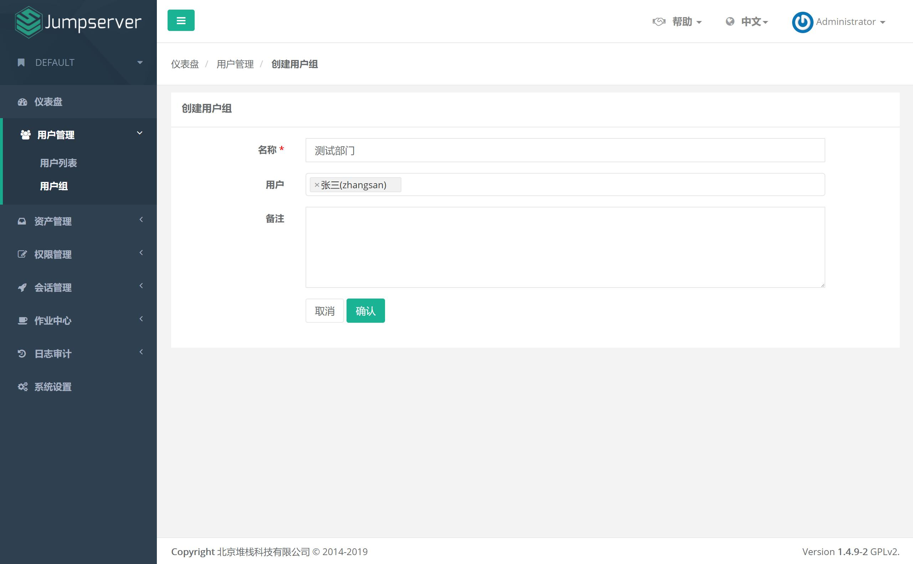

用户管理
=============

一、用户列表
```````````````````

1.1 创建用户

点击页面左侧"用户列表"菜单下的"用户列表", 进入用户列表页面。



点击页面左上角"创建用户"按钮, 进入创建用户页面, 填写账户, 角色安全, 个人等信息。

其中, 用户名即 Jumpserver 登录账号。用户是用于资产授权, 当某个资产对一个用户授权后, 这个用户就使用这个资产了。角色用于区分一个用户是管理员还是普通用户。

.. image:: _static/img/admin_users_user_create.jpg

成功提交用户信息后, Jumpserver 会发送一条设置"用户密码"的邮件到您填写的用户邮箱。

点击邮件中的设置密码链接, 设置好密码后, 您就可以用户名和密码登录 Jumpserver 了。

二、用户组
````````````````

2.1 创建用户组

用户组, 顾名思义, 给用户分组。用户组信息很有用, 在分配资产权限的时候, 针对的某个用户组下的所有用户, 可以为一个用户分配多个用户组。

点击页面左侧"用户管理"菜单下的"用户组", 进入用户组列表页面。

.. image:: _static/img/admin_user_group_list.jpg

点击页面左上角"创建用户组"按钮, 进入创建用户组页面：

名称即用户组名称, 建议填写简单明了有用的信息。创建用户组的时候可以把已存在的用户加入到该分组中, 一个用户可以存在多个分组中。


