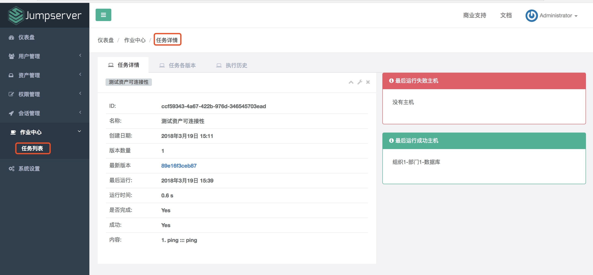

作业中心
==============

作业是 Jumpserver 向其所管理下的资产发送的指令, 例如, 测试资产可连接性、获取资产硬件信息、测试管理用户可连接性和测试系统用户可连接性等命令。默认展示最近7天的作业记录。

.. image:: _static/img/admin_work_center.jpg

点击作业名称可以查看作业的具体详情、作业的历史版本以及作业执行的历史记录：

