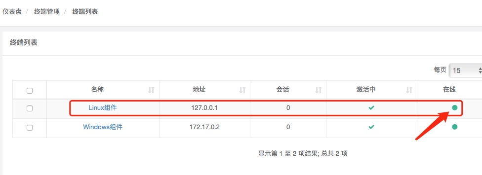
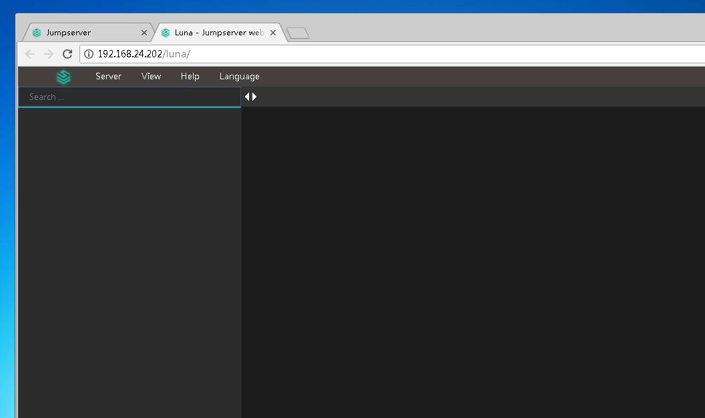
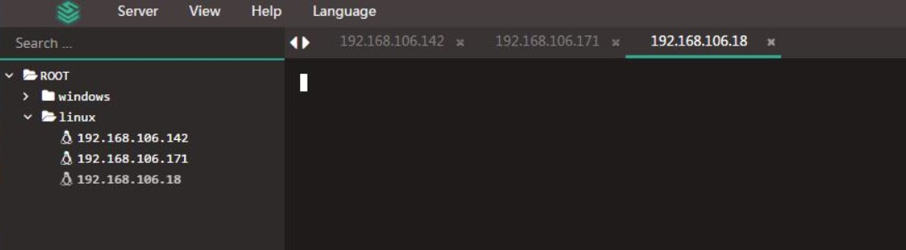
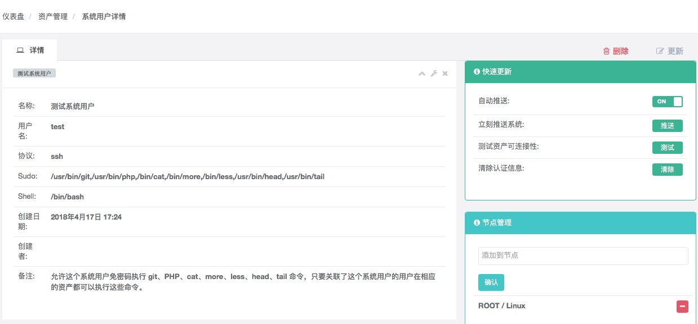
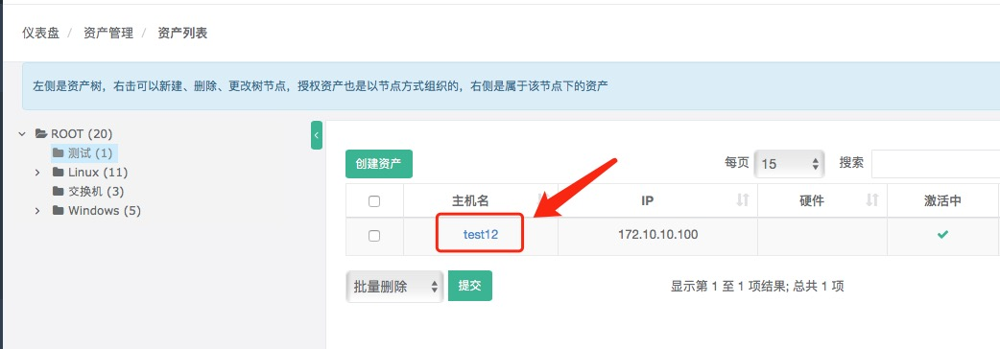
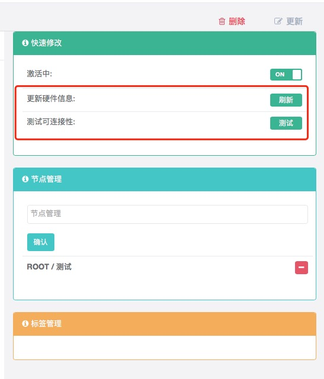
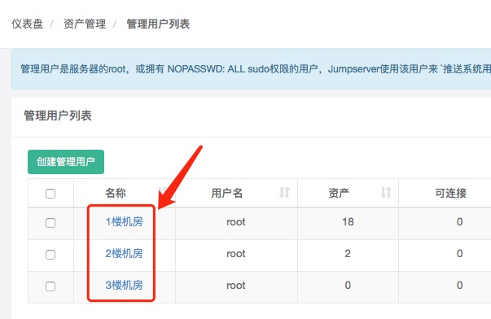
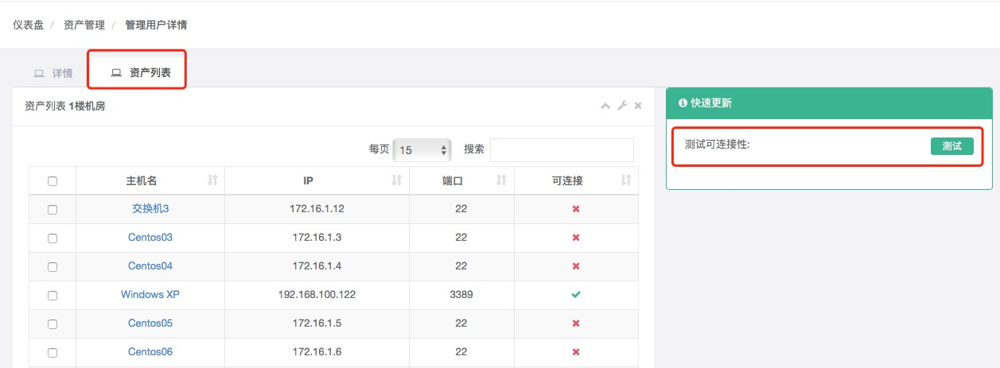
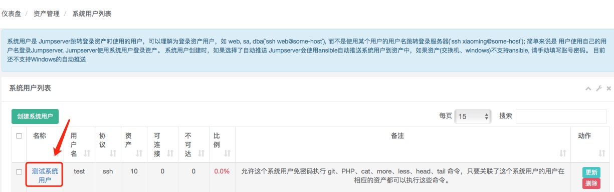
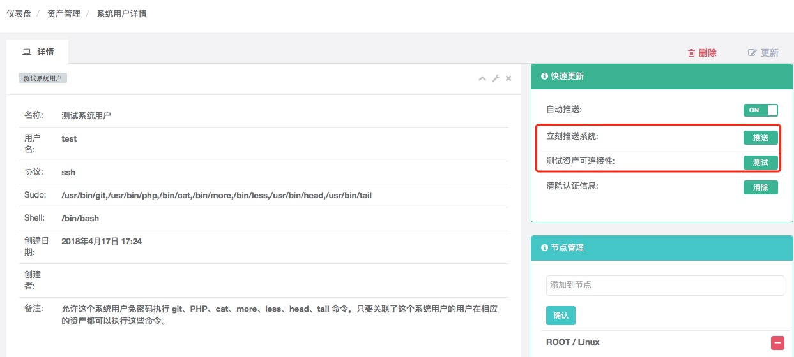

Linux 资产连接说明
----------------------------

Linux 资产连接错误排查思路

::

    (1). 检查管理用户的权限是否正确，权限需要与root权限一致
    (2). 检查资产的防火墙策略，可以在资产上面新建个用户，尝试用此用户在jumpserver服务器上进行ssh连接
    (3). 检查资产的python，确定版本不小于2.6，不高于3.x
    (4). 检查资产的ssh策略，确保可以被jumpserver应用访问

1. 检查终端是否在线

::

    # 确定已经在Jumpserver后台 会话管理-终端管理 里接受 coco 的注册

    # 如果不在线请检查 Linux 组件是否正常运行，箭头指示处 绿色表示正常，红色表示异常
    $ ps -ef | grep cocod | grep -v grep
    $ cat /opt/coco/logs/coco.log  # 检查有没有 error

    # 如果不在线可以尝试重启 coco
    $ source /opt/py3/bin/activate
    $ cd /opt/coco
    $ ./cocod stop  # 请用 ps 命令确定 coco 进程已经退出后再继续操作
    $ ./cocod start  # 后台运行使用 -d 参数./cocod start -d

    # 如果重启后 coco 任然不在线，请重新注册
    # 在Jumpserver后台 会话管理-终端管理 删掉 coco 的注册
    $ cd /opt/coco && ./cocod stop
    $ rm /opt/coco/keys/.access_key  # coco, 如果你是按文档安装的，key应该在这里，如果不存在，直接下一步
    $ ./cocod start -d  # 正常运行后到Jumpserver 会话管理-终端管理 里面接受coco注册

2. 访问 luna 界面不显示资产信息

::

    # 确定已经授权资产给当前登录用户
    # 确定 Jumpserver 的版本与 luna 的版本一致，如不一致请参考升级文档进行处理

    # Jumpserver 版本可在 jumpserver页面右下角 看到
    # Luna 版本可在 luna页面左下角 看到

    # 注：更新后请清理浏览器缓存后再访问

3. 访问 Linux 资产无任何提示

::

    # 请参考第一条检查终端是否在线
    # 检查 coco 的 ws 端口（默认 5000）
    # 检查 nginx 配置的 socket.io 设置是否有误

4. 登录资产提示 Authentication failed

::

    # 请检查推送
    # 在 资产管理-系统用户 下，点击相应的 系统用户名称 可以看到 系统用户详情，右边可以测试

5. 推送成功后无法登录资产，或者推送的系统用户 id 不正确 home 目录权限错误

::

    # 登录该资产，删除掉错误权限的用户，然后重新推送即可

6. coco 启动时报错 Failed register terminal unknow: xxx-xxx.xxx

::

    # 这是因为当前系统的 hostname 有 coco 不支持的字符，需要手动指定 coco 的 NAME
    $ cd /opt/coco/
    $ vim conf.py

    # 项目名称, 会用来向Jumpserver注册, 识别而已, 不能重复
    # NAME = "localhost"
    NAME = "localhost"

7. 测试可连接性 及 更新硬件信息

::

    # 注意不要拦截窗口

8. 管理用户 测试可连接性

::

    # 注意不要拦截窗口

9. 系统用户 推送 测试资产可连接性

::

    # 注意不要拦截窗口

10. ssh 使用key 登录资产提示 所选的用户密钥未在远程主机上注册

::

    # 这里是信息填写错误，ip端口应该填coco服务器的ip，端口应该填coco服务的ssh端口（默认2222）

11. 连接测试常见错误

::

    # 提示 to use the 'ssh' connection type with passwords, you mast install the sshpass program
    # Centos
    $ yum -y install sshpass

    # Ubuntu
    $ apt-get -y install sshpass

    # 注意，在 coco 服务器上面安装完成后需要重启服务。

    # 提示 Authentication failure
    # 一般都是资产的管理用户不正确

    # 提示Failed to connect to the host via ssh: ssh_exchange_identification: read: Connection reset by peer\r\n
    # 一般是资产的 ssh 或者 防火墙 做了限制，无法连接资产（资产信息填错也可能会报这个错误）
    # 检查防火墙设置以及 /etc/hosts.allow /etc/hosts.deny

    # 提示 "MODULE FAILURE","module_stdout":"/bin/sh: 1: /usr/bin/python: not found\r\n","module_stderr":"Shared connection to xx.xx.xx.xx closed.\r\n"
    # 一般是资产 python 未安装或者 python 异常

其他问题可参考 `FAQ <faq.html>`_
