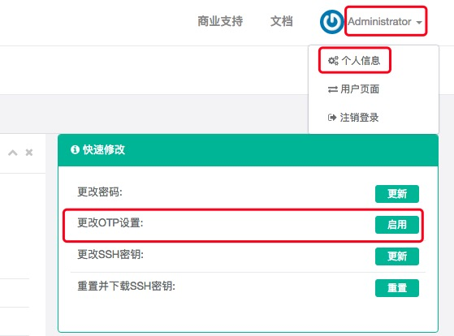

MFA 使用说明
--------------------------------------------------------

Multi-Factor Authentication (MFA) 遵循基于时间的一次性密码 (TOTP) 标准 (RFC 6238)

.. code-block:: vim

    # 关闭也是在这里, 点击此处的重置即可
    # 部分安卓手机无法使用 Google Authenticator, 可以尝试使用系统自带的【扫一扫】工具
    # 或者尝试使用第三方软件 (如 Microsoft Authenticator 、身份宝 等)

MFA遗失无法登陆

    .. code-block:: vim

        # 普通用户联系管理员关闭MFA, 登录成功后用户在个人信息里面重新绑定.
        # 如果管理员遗失无法登陆, 修改数据库 users_user 表对应用户的 otp_level 为 0, 重新登陆绑定即可
        $ mysql -uroot
        > use jumpserver;
        > update users_user set otp_level='0' where username='admin';  # admin 为你要修改的用户

        # 如果在系统设置里面开启的 MFA 二次认证, 需要修改数据库 settings 表 SECURITY_MFA_AUTH 的 value 值为 false
        mysql -uroot
        > use jumpserver;
        > update settings set value='false' where name='SECURITY_MFA_AUTH';
