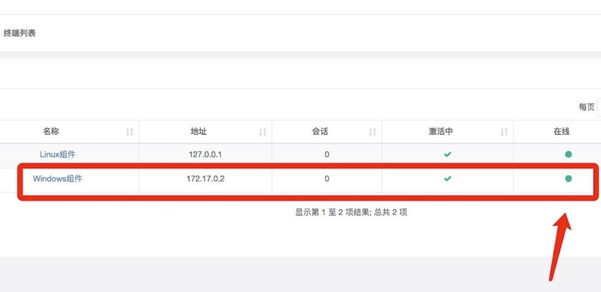
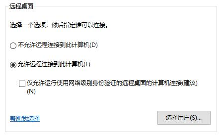
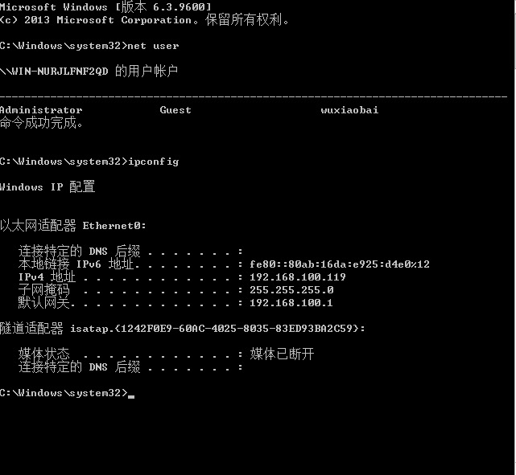
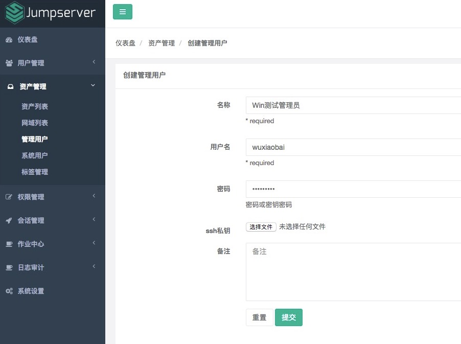
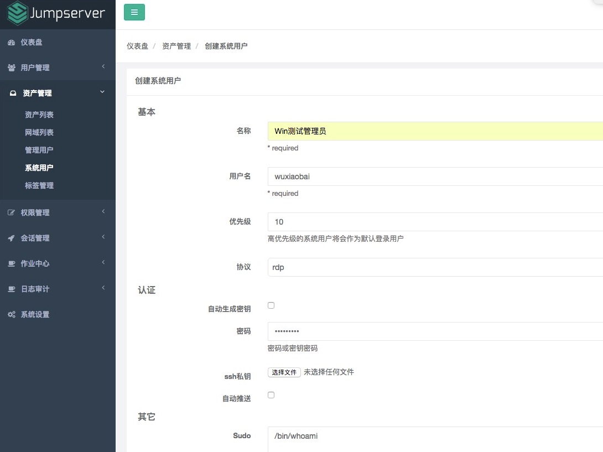
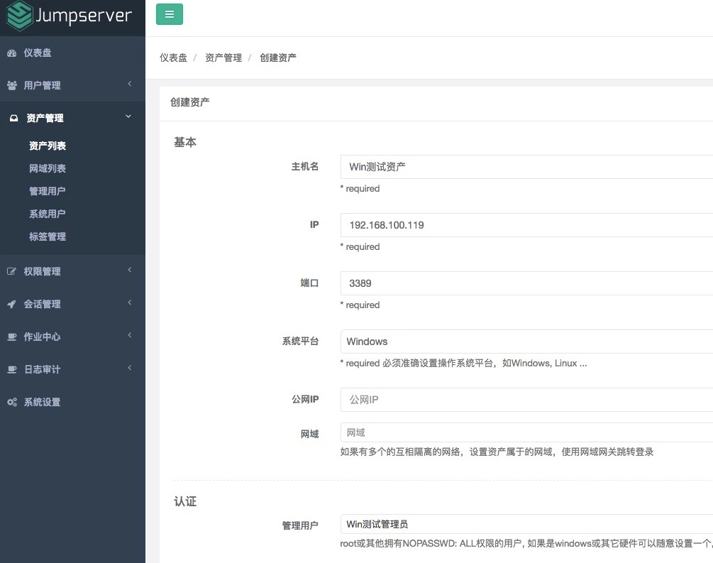
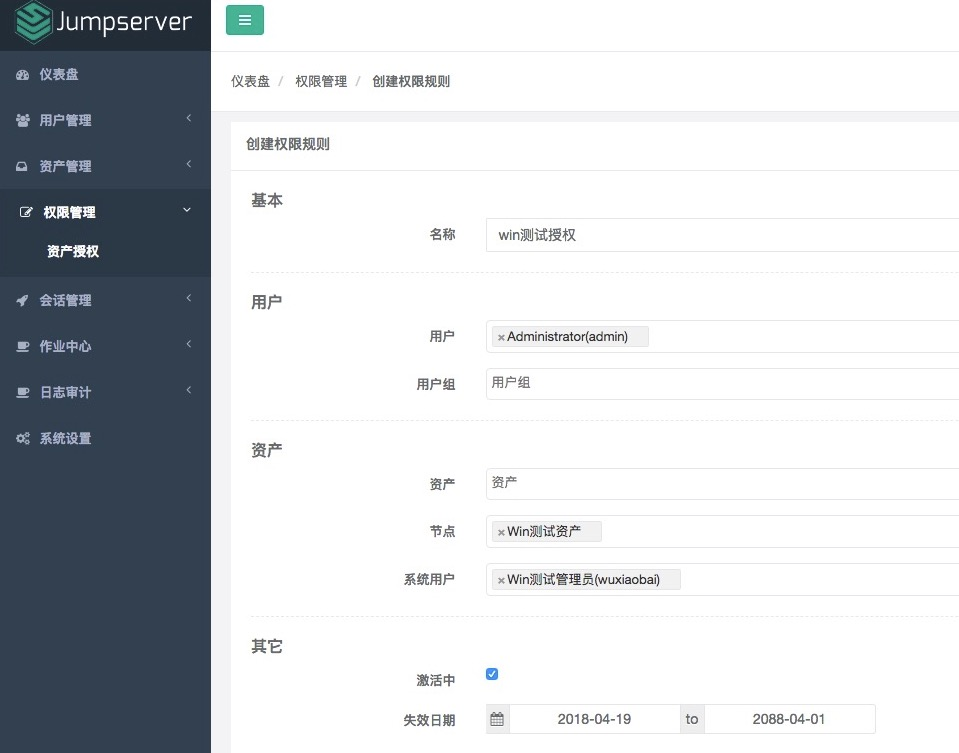
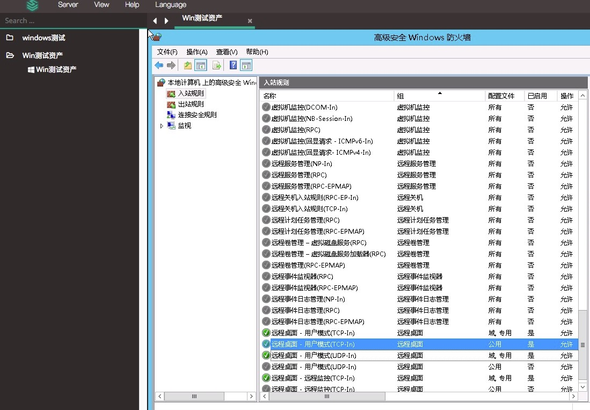

RDP 协议资产连接说明
------------------------------

RDP 协议资产连接错误排查思路

.. code-block:: vim

    (1). 如果白屏  检查nginx配置文件的guacamole设置ip是否正确, 检查终端管理的gua状态是否在线
    (2). 如果显示没有权限 是你 终端管理里 guacamole 状态为红色或者没有注册成功
    (3). 如果显示未知问题 可能是你的资产填写的端口不对, 或者授权的系统用户的协议不是rdp
    (4). 提示无法连接服务器 一般情况下是登录的系统账户不正确或者防火墙设置有误, 资产的信息填写不正确也会报这个错误
    (5). 提示网络问题无法连接或者超时, 请检查网络连接并重试, 或联系管理员 一般情况下网络有问题

1. 检查终端是否在线

.. code-block:: shell

    # 如果终端不在线, 请检查 guacamole 的 BOOTSTRAP_TOKEN 是否与 jumpserver 一致, 如果不一致请修改后重启
    $ cat /opt/jumpserver/config.yml | grep BOOTSTRAP_TOKEN
    $ env | grep BOOTSTRAP_TOKEN

    $ /etc/init.d/guacd stop
    $ sh /config/tomcat8/bin/shutdown.sh
    $ rm -rf /config/guacamole/keys/*
    $ /etc/init.d/guacd start
    $ sh /config/tomcat8/bin/startup.sh

    # docker 部署请直接删除容器后重建, 记得一定要先在 终端管理 删除不在线的组件
    $ docker stop jms_guacamole
    $ docker rm jms_guacamole

    # http://<Jumpserver_url> 指向 jumpserver 的服务url, 如 http://192.168.244.144:8080
    # BOOTSTRAP_TOKEN 为 Jumpserver/config.yml 里面的 BOOTSTRAP_TOKEN
    $ docker run --name jms_guacamole -d -p 8081:8081 -e JUMPSERVER_SERVER=http://<Jumpserver_url> -e BOOTSTRAP_TOKEN=xxxxxx jumpserver/jms_guacamole:1.5.0

    # 正常运行后到Jumpserver 会话管理-终端管理 里面查看 gua 的状态是否为绿色(等待大概5s后刷新页面)

2. 登录要连接的windows资产, 检查远程设置和防火墙设置

.. code-block:: vim

    # Windows 7/2008 勾选 允许运行任意版本远程桌面的计算机连接(较不安全)(L)
    # Windows 8/10/2012 勾选 允许远程连接到此计算机(L)

    # Windows防火墙-高级设置-入站规则 把远程桌面开头的选项 右键-启用规则
    # Windows 7/2008 启用 远程桌面(TCP-In)
    # Windows 8/10/2012 启用 远程桌面-用户模式(TCP-In)

3. 登录要连接的windows资产, 检查用户和IP信息(Windows目前还不支持推送, 所以必须使用资产上面已存在的用户进行登录)

.. code-block:: vim

    # 注：因为 windows 暂时不支持推送, 所以必须使用资产上面已经存在的账户进行登录, 如 administrator 账户

4. 创建Windows资产管理用户(如果是域资产, 格式是uesr@domain.com)

.. code-block:: vim

    # 不带域的用户直接输入用户名即可, 如 administrator
    # 域用户的用户名格式为 user@domain.com, 如 administrator@jumpserver.org

5. 创建Windows资产系统用户(如果是域资产, 格式是uesr@domain.com, 注意协议不要选错)

.. code-block:: vim

    # 注：因为 windows 暂时不支持推送, 所以必须使用资产上面已经存在的账户进行登录, 如 administrator 账户
    # 不带域的用户直接输入用户名即可, 如 administrator
    # 域用户的用户名格式为 user@domain.com, 如 administrator@jumpserver.org
    # 如果想让用户登录资产时自己输入资产的账户密码, 可以点击系统用户的名称 点击清除认证信息
    # 此处必须输入能正确登录 windows 资产的 账户密码
    # 如不确实是不是因为密码或者账户信息错误导致的无法登录, 可以使用手动登录功能(在系统用户处设置)

6. 创建Windows资产(注意端口不要填错)

.. code-block:: vim

    # Windows 7/8/2008/2012 "系统平台"选择 "Windows"
    # Windows 10/2016 "系统平台"选择 "Windows(2016)"

7. 创建授权规则

.. code-block:: vim

    # 先定位到 windows 的资产, 然后授权, 如果资产用户密码不一致, 请不要直接在节点上授权

8. 使用web terminal登录(如果登录报错, 检查防火墙的设置, 可以参考FAQ)

9. Windows 资产文件上传和下载

.. code-block:: vim

    # 直接拖拽文件到 windows 窗口即可, 文件上传后在 Guacamole RDP上的 G 目录查看
    # 下载在 luna 页面, 按 ctrl+alt+shift, 选择文件下载即可

.. image:: _static/img/faq_windows_08.jpg

其他问题可参考 `FAQ <faq.html>`_
