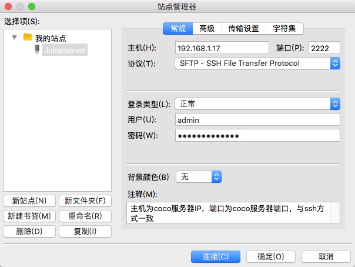

sftp 使用说明
-------------------------------------------------------
在Windows上使用 sftp 工具传输文件到 Linux 系统,默认的上传目录在 /tmp ,其他目录没有权限

.. code-block:: shell

    # 连接成功后,可以看到当前拥有权限的资产,打开资产,然后选择系统用户,即可到资产的 /tmp 目录
    $ sftp -P2222 admin@192.168.244.144  # Linux 语法
    $ sftp 2222 admin@192.168.244.144  # xshell 语法

    $ ls 列出资产目录
    $ cd 你的资产
    $ ls 列出你的系统用户
    $ cd 你的系统用户
    # 此处即是当前资产的 home 目录

    # 如果需要修改 /tmp 为其他目录
    $ vi coco/coco/sftp.py

.. code-block:: python

    class SFTPServer(paramiko.SFTPServerInterface):
        root = '/tmp'
        # 修改 /tmp 为你要指定的目录,如: root = '/'
        # 如果需要指定为用户自己的 home 目录，可以改为 root = 'home'
