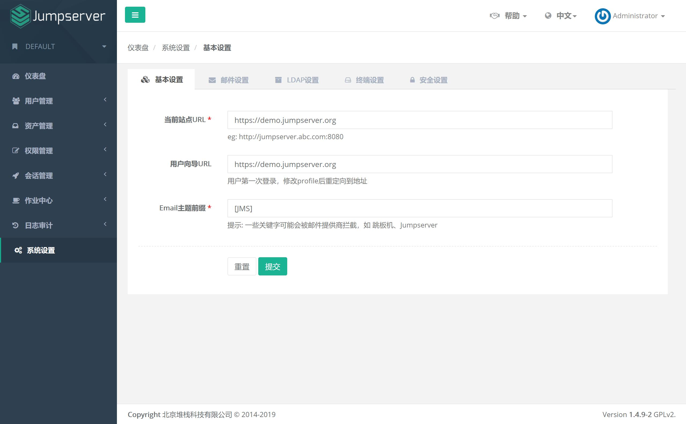
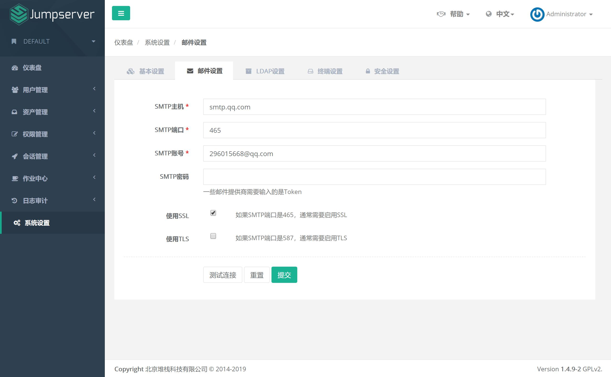
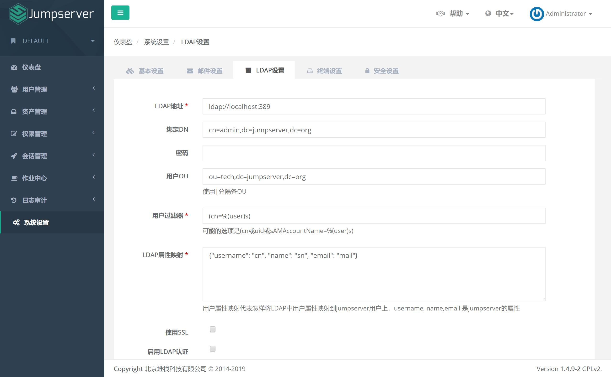
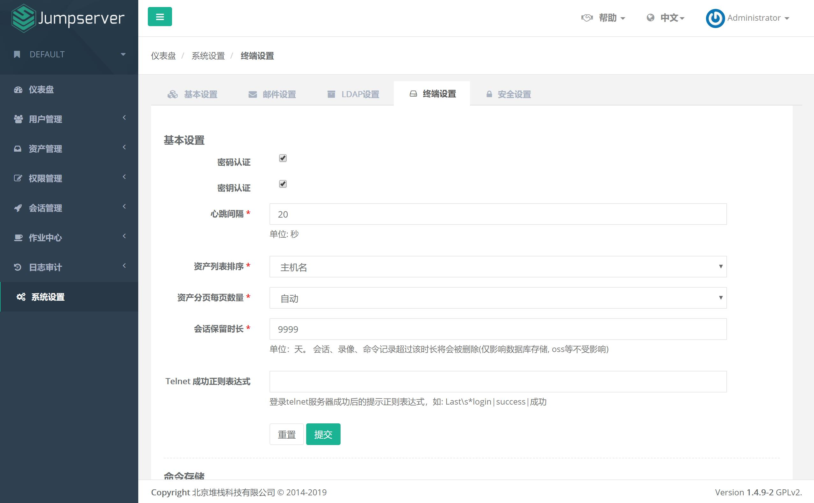
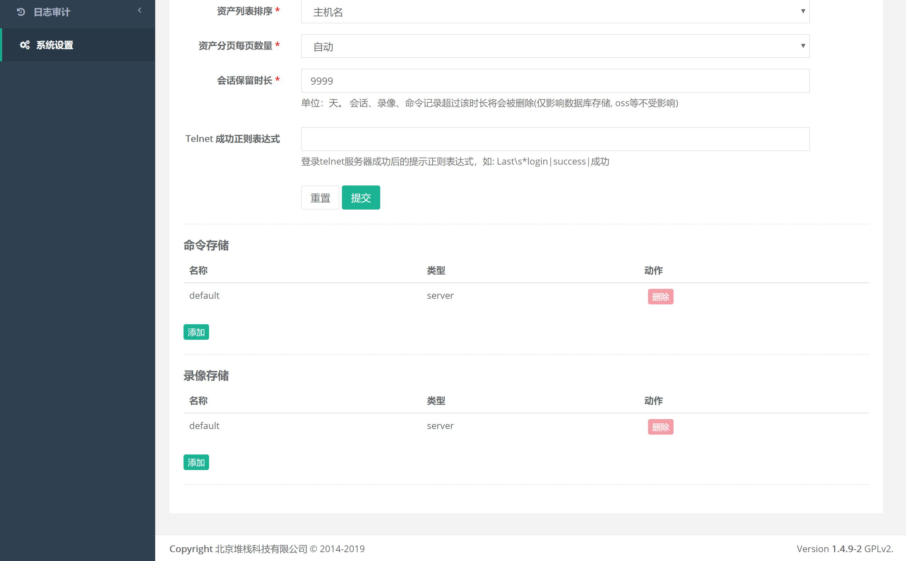
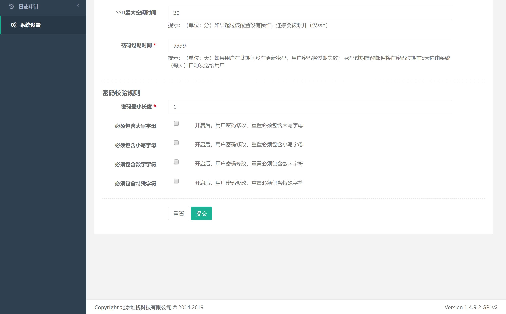
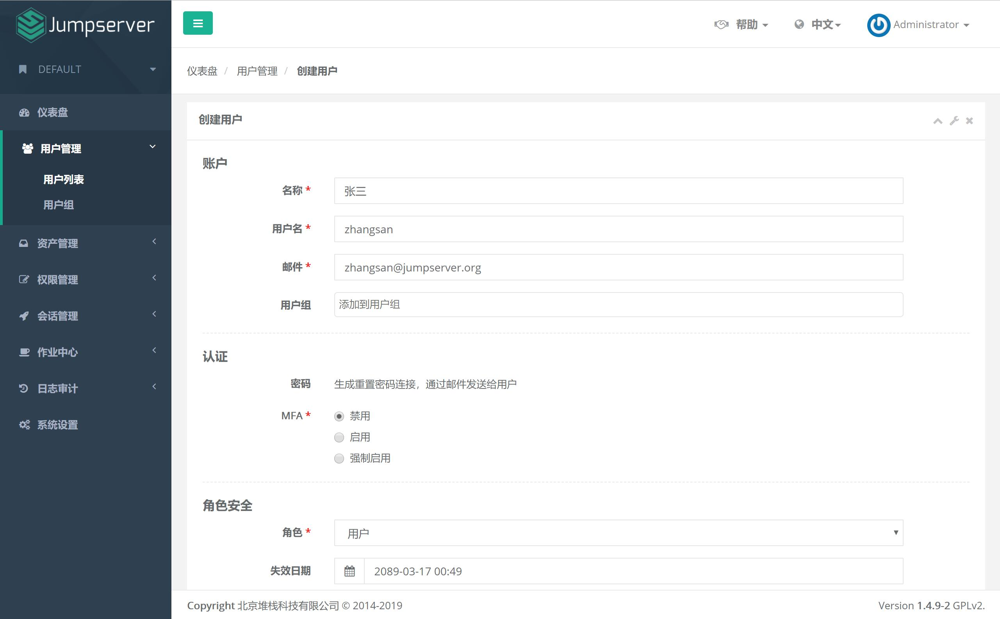
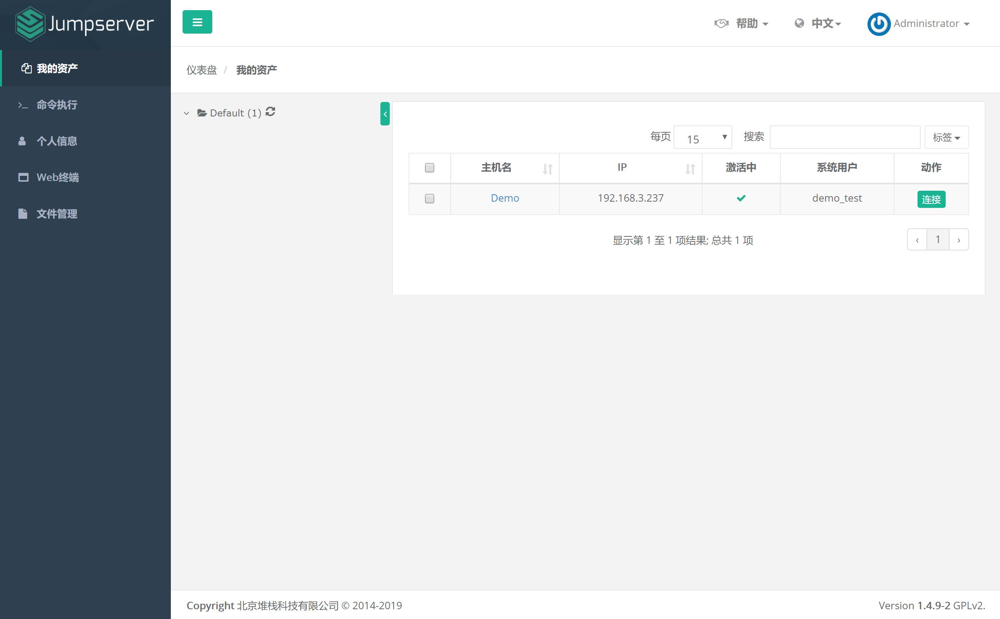
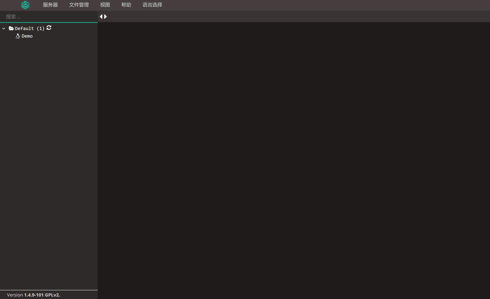

快速入门
==================

说明
``````````
- 到 Jumpserver 会话管理-终端管理 查看 Coco Guacamole 等应用是否在线

一、系统设置
````````````````````

**1.1 基本设置**
----------------

.. code-block:: vim

    # 修改 url 的"localhost"为你的实际 url 地址, 否则邮件收到的地址将为"localhost" 也无法创建新用户



**1.2 邮件设置**
----------------

.. code-block:: vim

    # 点击页面上边的"邮件设置", 进入邮件设置页面
    # 默认使用 25 端口, 不勾选 SSL 和 TLS; 如果需要勾选 SSL, 端口需要修改成 465; 如果需要勾选 TLS, 端口需要改成 587
    # 不可以同时勾选 SSL 和 TLS
    # 配置邮件服务后, 点击页面的"测试连接"按钮, 如果配置正确, Jumpserver 会发送一条测试邮件到您的 SMTP 账号邮箱里面, 确定收到测试邮件后点击保存即可使用



**1.3 LDAP设置**
-----------------

.. code-block:: vim

    # 如果不需要使用"ldap"用户登陆 jumpserver, 可以直接跳过, 不需要设置
    # 先"测试"通过才能保存
    # DN 和 OU 一定要完整(如 "DN:cn=Manage,ou=Jumpserver,dc=jumpserver,ou=org")
    # 注：可借用第三方 gui 工具查看 ldap 用户的属性, 新版本已经支持中文名登录, 即cn=中文也可正常使用



参考 `LDAP 使用说明 <faq_ldap.html>`_

**1.4 终端设置**
----------------

.. code-block:: vim

    # "密码认证"和"密钥认证"是 SSH 连接跳板机时所使用的认证方式(都不选会造成无法使用 SSH 方式连接登录跳板机, 不影响 web 登录)
    # "Telnet成功正则表达式" telnet设备登陆失败需要设置
    # "命令存储""录像存储"位置设置

    # "命令存储""录像存储"修改后, 需要在Jumpserver 会话管理-终端管理 修改terminal的配置 录像存储 命令记录, 然后重启 Jumpserver 服务
    # 设置后重启 Coco 才能生效




**1.5 安全设置**
----------------

.. code-block:: vim

    # "MAF二次认证"勾选会开启全局强制"MFA", 所有 jumpserver 用户必须使用动态口令进行认证登录(即时生效)
    # "限制登录失败"和"限制登录时间"设置需要重启 jumpserver 才能生效
    # "SSH最大空闲时间"设置需要重启 coco 才能生效
    # "密码校验规则"设置立即生效

.. image:: _static/img/admin_settings_security_list_01.jpg


二、用户管理
`````````````````````

**2.1 创建 Jumpserver 用户**
----------------------------

.. code-block:: vim

    # 点击页面左侧"用户列表"菜单下的"用户列表", 进入用户列表页面
    # 点击页面左上角"创建用户"按钮, 进入创建用户页面, (也可以通过右上角导入模版进行用户导入)
    # 其中, 用户名即 Jumpserver 登录账号(具有唯一性, 不能重名)。名称为页面右上角用户标识(可重复)
    # 成功提交用户信息后, Jumpserver 会发送一条设置"用户密码"的邮件到您填写的用户邮箱
    # 点击邮件中的设置密码链接, 设置好密码后, 您就可以用户名和密码登录 Jumpserver 了。
    # 用户首次登录 Jumpserver, 会被要求完善用户信息, 按照向导操作即可。
    注：MFA 即 Google Authenticator, 使用此软件需要APP时间与浏览器时间同步



三、资产管理
``````````````````

**3.1 编辑资产树**
------------------------

.. code-block:: vim

    # "节点"不能重名, 右击节点可以添加、删除和重命名节点, 以及进行资产相关的操作
    注：如果有 linux 资产和 windows 资产, 建议先建立 Linux 节点与 Windows 节点, 不然"授权"时不好处理

.. image:: _static/img/admin_assets_asset_list.jpg

**3.2 创建管理用户**
------------------------

.. code-block:: vim

    # "管理用户"是资产上的 root, 或拥有 NOPASSWD: ALL sudo 权限的用户, Jumpserver 使用该用户来推送系统用户、获取资产硬件信息等。 Windows或其它硬件可以随意设置一个
    # "名称" 不能重复
    # "ssh私钥" 如果私钥有密码, 请把key的密码填在密码栏上, 目前仅支持 RSA DSA 格式私钥

.. image:: _static/img/admin_assets_admin-user_create.jpg

**3.3 创建系统用户**
------------------------

.. code-block:: vim

    # "系统用户"是 Jumpserver 跳转登录资产时使用的用户, 用户使用该用户登录资产
    # "自动生成密码"、"自动推送"、"Sudo"等功能需要对应资产的"管理用户"是且有root权限, 否则自动推送失败
    # ssh 协议的 "Sudo" 栏设定用户的 sudo 权限,
    # ssh 协议如果创建的"系统用户"已在资产上面存在, "推送"将会覆盖掉原用户的"home"目录权限(注: 替换成700权限)
    # ssh 协议的 "ssh私钥" 如果私钥有密码, 请把key的密码填在密码栏上, 目前仅支持 RSA DSA 格式私钥

    # 这里简单举几个 "sudo" 设置例子
    Sudo /bin/su  # 当前系统用户可以免sudo密码执行sudo su命令

    Sudo /usr/bin/git, /usr/bin/php, /bin/cat, /bin/more, /bin/less, /usr/bin/tail
    # 当前系统用户可以免sudo密码执行git php cat more less tail

    Sudo !/usr/bin/yum  # 当前系统用户不可以执行sudo yum命令

    # 此处的权限应该根据使用用户的需求汇总后定制, 原则上给予最小权限即可

    # "系统用户"创建时, 如果选择了"自动推送" Jumpserver 会使用"Ansible"自动推送系统用户到资产中, "root"用户不支持推送
    # 如果资产(交换机、Windows)不支持"Ansible", 请去掉"自动生成密钥"、"自动推送"勾选。手动填写资产上已有的账号及账号密码

    # 如果想让用户登录资产时自己输入密码, 可以在创建系统用户时选择"手动登录"

.. image:: _static/img/admin_assets_system-user_create_01.jpg
.. image:: _static/img/admin_assets_system-user_create_02.jpg

**3.4 创建命令过滤**
------------------------

如无需要, 可忽略此步骤, 目前仅支持 ssh 与 telnet 协议

.. code-block:: vim

    # "系统用户"可以绑定一些"命令过滤器"，一个过滤器可以定义一些"规则"
    # 当"用户"使用这个"系统用户"登录资产，然后执行一个命令 这个命令需要被绑定过滤器的所有规则匹配，高优先级先被匹配
    # 当一个规则匹配到了，如果规则的动作是 "允许" 这个命令会被放行； 如果规则的动作是 "禁止" 命令将会被禁止执行； 否则就匹配下一个规则，如果最后没有匹配到规则，则允许执行

.. image:: _static/img/admin_assets_cmd-filter_create.jpg

.. code-block:: vim

    # 点击 "命令过滤器列表" 规则下方的数字进入 "命令过滤器规则列表" , 点击新建规则创建相应规则
    # 拒绝所有命令可以使用正则表达式 .*

.. image:: _static/img/admin_assets_cmd-filter_rule_create.jpg

**3.5 创建网域网关**
------------------------

如无需要, 可忽略此步骤, 支持代理SSH、RDP和VNC

.. code-block:: vim

    # "网域"功能是为了解决部分环境无法直接连接而新增的功能, 原理是通过网关服务器进行跳转登录
    # 点击页面左侧的"网域列表"按钮, 查看所有网域列表
    # 点击页面左上角的"创建网域"按钮, 进入网域创建页面, 选择资产里用作网域的网关服务器
    注：混合云适用

.. image:: _static/img/admin_assets_domain_create.jpg

.. code-block:: vim

    # 点击"网域"的名称, 进入"网域详情"列表。
    # 点击页面的"网关"按钮, 选择网关列表的"创建网关"按钮, 进入网关创建页面, 填写网关信息
    # IP信息一般默认填写网域资产的IP即可(如用作网域的资产有多块网卡和IP地址, 选能与jumpserer通信的任一IP即可)
    注：用户名与密码可以使用网关资产上已存在的任一拥有执行 ssh 命令权限的用户

.. image:: _static/img/admin_assets_domain_gateway_create.jpg

.. code-block:: vim

    注: 保存信息后点击"测试连接", 确定设置无误后到资产列表添加需要使用"网关"登录的资产即可
    注: "Windows资产"可以使用"ssh网关"

**3.6 创建资产**
------------------------

.. code-block:: vim

    # 点击页面左侧的"资产管理"菜单下的"资产列表"按钮, 查看当前所有的资产列表。
    # 点击页面左上角的"创建资产"按钮, 进入资产创建页面, 填写资产信息。
    # IP 地址和管理用户要确保正确, 确保所选的管理用户的用户名和密码能"牢靠"地登录指定的 IP 主机上。
    # 资产的系统平台也务必正确填写。公网 IP 信息只用于展示, 可不填, Jumpserver 连接资产使用的是 IP 信息。

.. image:: _static/img/admin_assets_asset_create.jpg

.. code-block:: vim

    # 资产创建信息填写好保存之后, ssh 协议资产可"测试资产"是否能正确连接, 其他协议暂不支持
    注：被连接资产需要"python"组件, 且版本大于等于2.6, Ubuntu等资产默认不允许root用户远程ssh登录, 请自行处理

    # 如果资产不能正常连接, 请检查"管理用户"的用户名和密钥是否正确以及该"管理用户"是否能使用 SSH 从 Jumpserver 主机正确登录到资产主机上

SSH 协议参考 `SSH 协议资产连接说明 <faq_ssh.html>`_

RDP 协议参考 `RDP 协议资产连接说明 <faq_rdp.html>`_

Telnet 协议参考 `Telnet 协议资产连接说明 <faq_telnet.html>`_

四、创建授权规则
`````````````````````

**4.1 为用户分配资产**
----------------------

.. code-block:: vim

    # "名称", 授权的名称, 不能重复
    # "用户"和"用户组"二选一, 不推荐即选择用户又选择用户组
    # "资产"和"节点"二选一, 选择节点会包含节点下面的所有资产
    # "系统用户", 及所选的用户或用户组下的用户能通过该系统用户使用所选节点或者节点下的资产
    # 用户(组), 资产(节点), 系统用户是一对一的关系, 所以当拥有 Linux、Windows 不同类型资产时, 应该分别给 Linux 资产和 Windows 资产创建授权规则

一般情况下, 资产授权给个人, 节点授权给用户组, 一个授权只能选择一个系统用户

.. image:: _static/img/admin_perms_asset-permission_create.jpg

五、用户登录
`````````````````````

**5.1 登录 Jumpserver**
-----------------------

.. code-block:: vim

    # 用户只能看到自己被管理员授权了的"资产", 如果登录后无资产, 请联系管理员进行确认



**5.2 连接资产**
-----------------------

.. code-block:: vim

    # 在我的资产点击资产右边的 "连接" 快速连接资产
    # 也可以点击左侧栏的 "Web终端"



.. code-block:: vim

    # 点击 "资产" 名字, 就连上资产了
    # 如果显示连接超时, 请参考 FAQ 文档进行处理

**5.3 断开资产**
-----------------------

.. code-block:: vim

    # 点击页面顶部的 "Server" 按钮会弹出选个选项, 第一个断开所选的连接, 第二个断开所有连接。

**5.4 文件管理**
-----------------------

.. code-block:: vim

    # 点击 "文件管理"
    # 先在左边选择资产, 目前只支持自动登录的 SSH 协议资产
    # 也可以使用 sftp 方式进行文件管理

参考 `SFTP 连接说明 <faq_sftp.html>`_

.. image:: _static/img/user_terminal_web-sftp_list.jpg

以上就是 Jumpserver 的简易入门了, Jumpserver 还有很多功能等待您去发现。在使用过程中, 如果遇到什么问题, 可以在文档的"联系方式"一栏找到我们。
