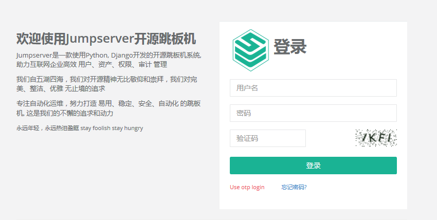
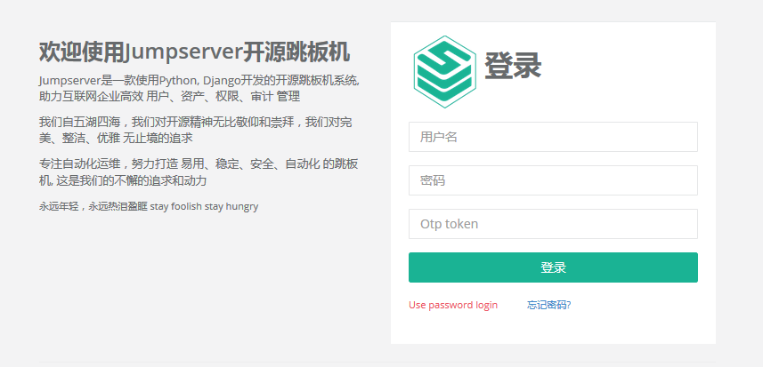
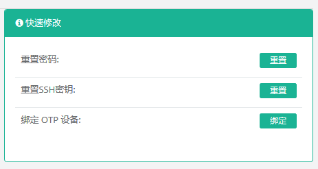
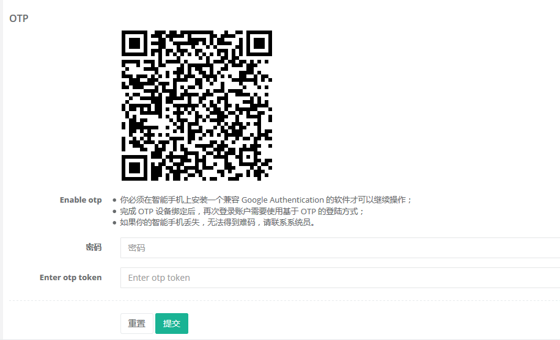
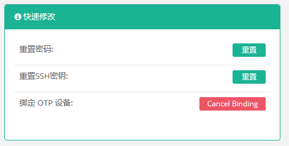
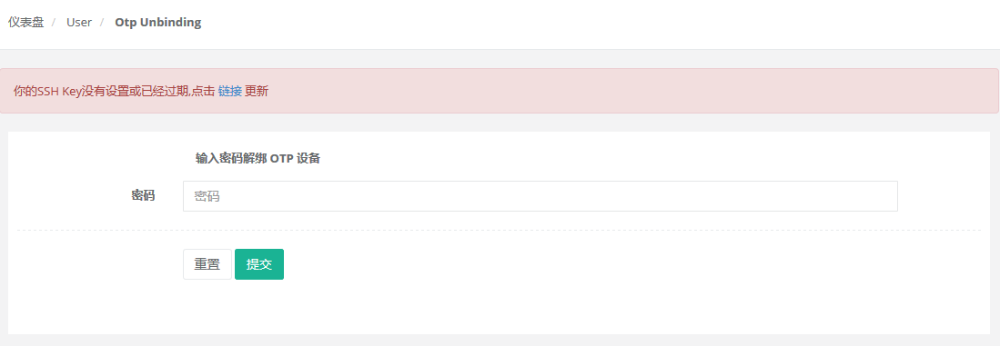

# OTP 使用指南

## 什么是 OTP 

OTP(One-time Password)一种密码算法，也称一次性密码算法，根据特定的算法生成只能使用一次的密码。Jumpserver 使用的是 google 开源的密码生成算法，基于固定的时间，生成一个与时间相关的、不可预测的随机数字组合。

OTP 提供了更安全的功能，除于需要输入传统的用户名和口令之外，还需要输入一个动态密码来完成认证。这个动态的密码一般使用智能手机上安装的与 google authenticator 兼容的软件来产生，黑客就算知道了你的用户名和密码，而没有你的手机也是无法登陆的。

OTP 软件可以使用 google authenticator，或者是阿里的身份宝（http://otp.aliyun.com/shenfenbao.html）。

## 登陆界面

这里另做了一个登陆界面，login-otp，开启了 OTP 功能的用户只能使用该界面来登陆，而使用 login 界面来登陆做提示错误信息。

注意：管理员强行开启 OTP，而没有设置过 secret-key，登陆会报错，需要管理员关闭 OTP 选项，让用户自行开启 OTP 功能。管理员强行开启 OTP 功能需要使用的同学可以考虑贡献下代码。

## 绑定 OTP 设备

没有绑定的 OTP 设备的同学，可以使用 个人信息 界面，使用专门的软件扫描二维码绑定。

## 解绑 OTP 设备

解绑也是通过使用 个人信息 界面来完成的，需要提供账号的密码来完成。

## 使用 SSH 登陆堡垒机

这是开启 OTP 界面后，使用 SSH 登陆堡垒机的界面。成功完成用户名和密码认证后，需要使用 otp token 进入主界面。

## 设置参数

目前在 apps/jumpserver/settings.py 中提供了一个 OTP_TOKEN_VALID_WINDOW 的值来设置 OTP token 的有效性，该值默认为 1，就是 OTP 软件当前的产生的密码，前一个密码，后一个密码为有效密码，一共有 3 个。你可以减小这个值以增加安全性，增大这个值提高容错性。

默认 SSH 尝试 otp token 为 5 次，写死在了程序中。