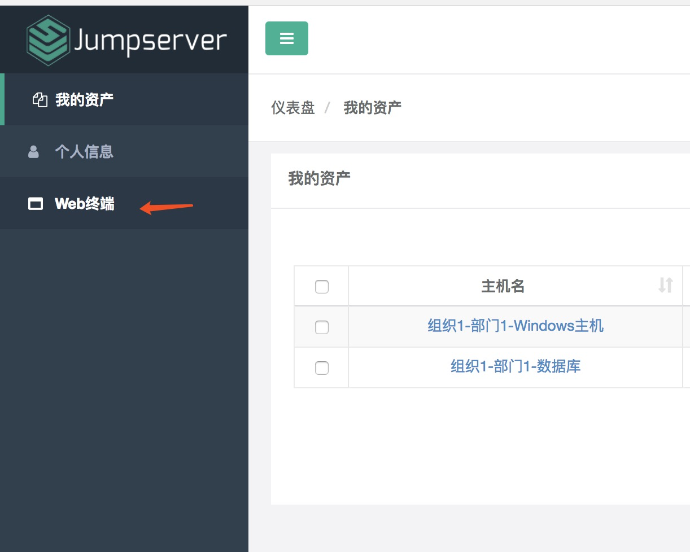
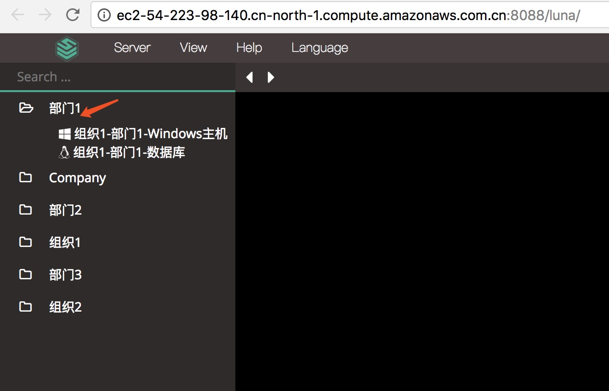
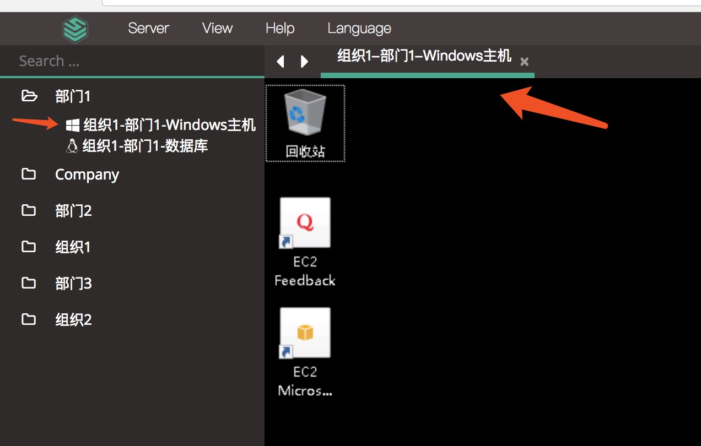
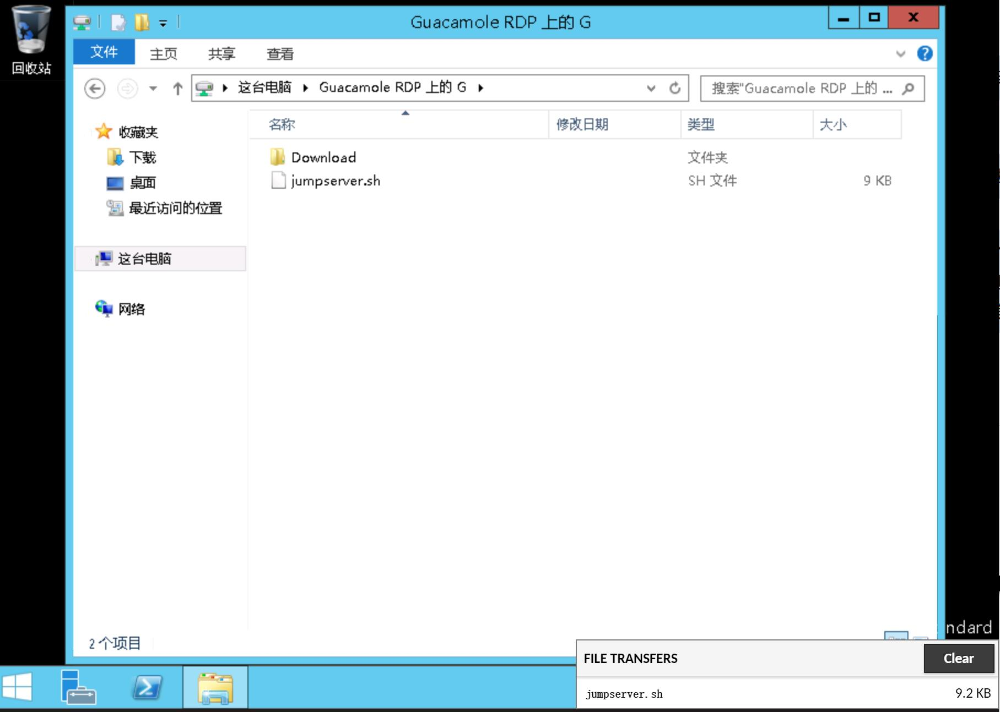
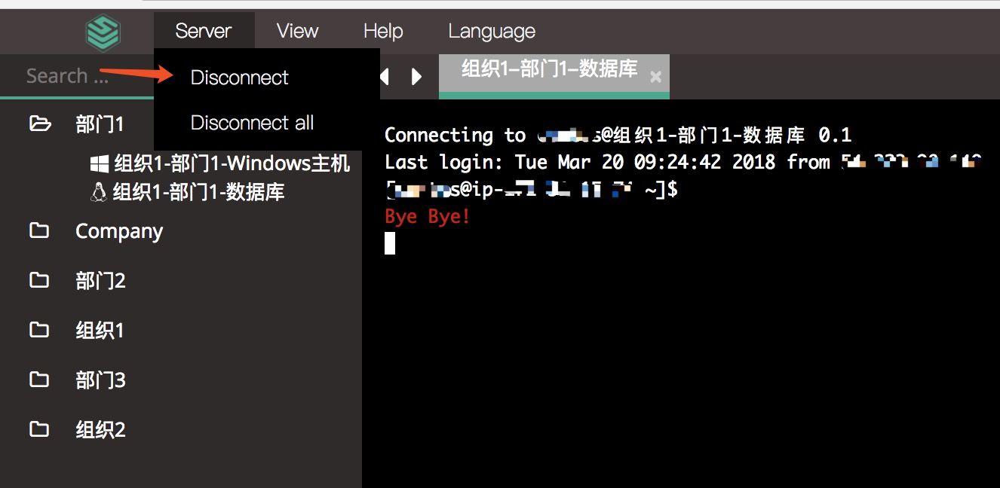
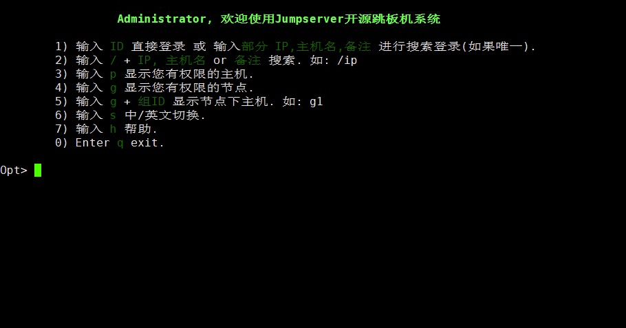

用户资产
================

1.1 Web 连接资产
~~~~~~~~~~~~~~~~~~~~~~~~~~

点击页面左边的 Web 终端：

打开资产所在的节点：

点击资产名字, 就连上资产了, 如果显示连接错误, 请联系管理员解决

1.2 Web 上传文件到 Win 资产
~~~~~~~~~~~~~~~~~~~~~~~~~~~~~~~~

Windows 资产的文件上传方式为：直接拖拽需要上传的文件到 Windows 资产窗口即可, 上传后的文件位置在资产的 Guacamole RDP上的 G 目录下

1.3 WEB 主机登出
~~~~~~~~~~~~~~~~~~~~~

点击页面顶部的 Server 按钮会弹出选个选项, 第一个断开所选的连接, 第二个断开所有连接:

1.4 SSH 连接资产
~~~~~~~~~~~~~~~~~~~~~

咨询管理员 跳板机服务器地址 及 端口, 使用 ssh 方式输入自己的用户名和密码登录(与Web登录的用户密码一致)

1.5 SSH 主机登出
~~~~~~~~~~~~~~~~~~~~~

推荐退出主机时使用 exit 命令或者 ctrl + d 退出会话

1.6 SFTP 上传文件到 Linux 资产
~~~~~~~~~~~~~~~~~~~~~~~~~~~~~~~~~~~

咨询管理员 跳板机服务器地址 及 端口, 使用 ssh 方式输入自己的用户名和密码登录(与 SSH 登录跳板机的用户密码一致)

连接成功后, 可以看到当前拥有权限的资产, 打开资产, 然后选择系统用户, 即可到资产的 /tmp 目录(/tmp 目录为管理员自定义)
