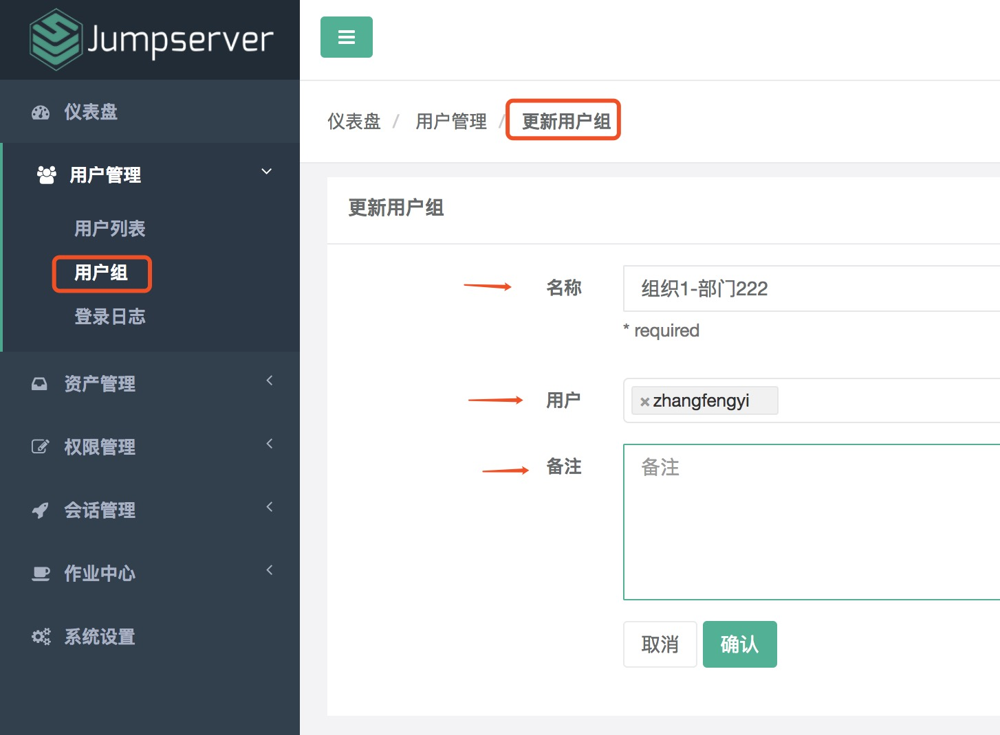
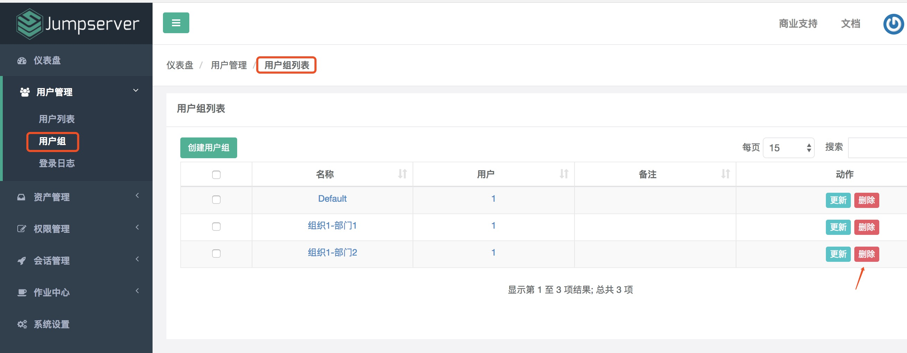
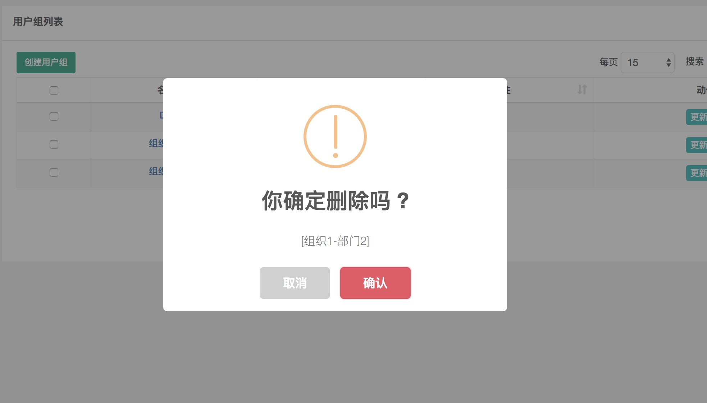

用户组
============

用户组，顾名思义，给用户分组。用户组信息很有用，在分配资产权限的时候，针对的某个用户组下的所有用户，可以为一个用户分配多个用户组。

点击页面左侧“用户管理”菜单下的”用户组“，进入用户组列表页面。

.. image:: _static/img/admin_user_group_list.jpg

一、创建用户组
````````````````````

名称即用户组名称，建议填写简单明了有用的信息。创建用户组的时候可以把已存在的用户加入到该分组中，一个用户可以存在多个分组中。

点击页面左上角“创建用户组”按钮，进入创建用户组页面：

.. image:: _static/img/admin_create_user_group.jpg

二、更新用户组
```````````````````````

点击页面右边的“更新”按钮，进入编辑用户组页面：



可以修改用户组名称，以及用户组下面的用户等信息。

修改完成后，点击"确认"按钮，完成用户组信息峰新。

三、删除用户组
```````````````````````

点击页面右边的“删除”按钮：



弹出删除确认框，点击“确认”按钮，删除用户组完成。

