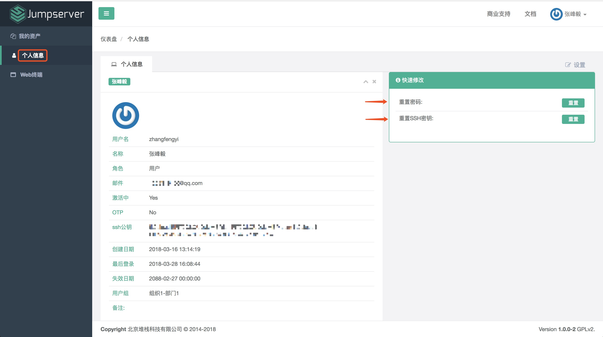
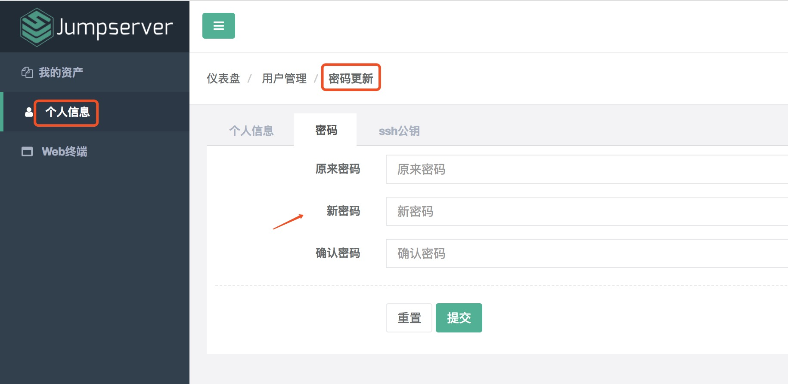
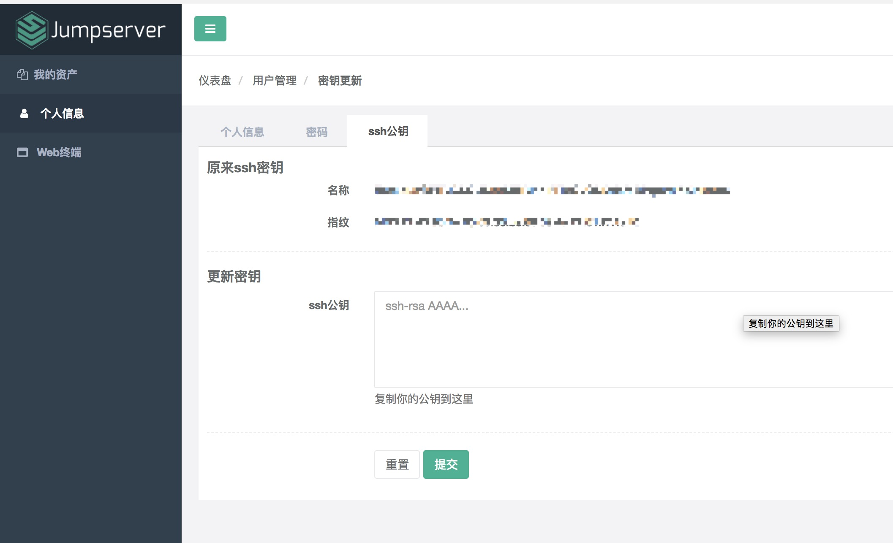

用户页面
=========

通过管理员发送的邮件里面的 Jumpserver 地址登录进行用户初始化

1.1 查看个人信息
~~~~~~~~~~~~~~~~~

个人信息页面展示了用户的名称、角色、邮件、所属用户组、SSh 公钥、创建日期、最后登录日期和失效日期等信息：

1.2 修改密码
~~~~~~~~~~~~~

在个人信息页面点击"更改密码"按钮, 跳转到修改密码页面, 正确输入新旧密码, 即可完成密码修改:

1.3 设置或禁用 MFA
~~~~~~~~~~~~~~~~~~~

在个人信息页面点击"设置MFA"按钮(设置完成后按钮会禁用MFA), 根据提示处理即可, MFA全称是Multi-Factor Authentication, 遵循(TOTP)标准(RFC 6238)

1.4 修改 SSH 公钥
~~~~~~~~~~~~~~~~~~

点击"重置 SSH 密钥"按钮, 跳转到修改 SSH 密钥信息页, 复制 SSH 密钥信息到指定框中, 即可完成 SSH 密钥修改：

查看 SSH 公钥信息：

::

    $ cat ~/.ssh/id_rsa.pub
    ssh-rsa AAAAB3NzaC1yc2EAAAADAQABAAABAQDadDXxxx......

1.5 查看个人资产
~~~~~~~~~~~~~~~~

自己被授权的资产, 增减授权资产的需求请联系管理员

.. image:: _static/img/user_login_success.jpg
