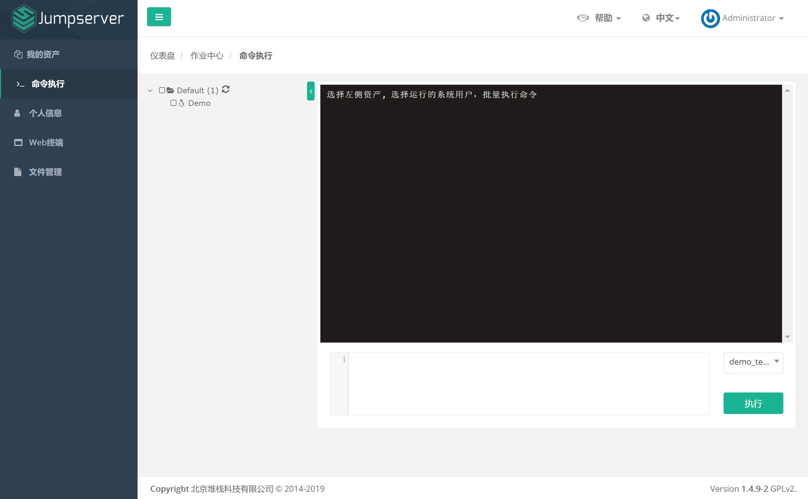

命令执行
================

可以通过该功能快速下发命令到资产, 目前仅支持能被 ansible 管理的资产, 要求 系统用户 登陆方式为 自动登陆

.. code-block:: vim

    # 在左侧先勾选资产, 在右下角根据需要切换系统用户, 在下方输入需要执行的命令, 点击执行即可
    # 仅支持标准的 shell 命令, 如: sudo ifconfig

